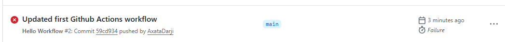
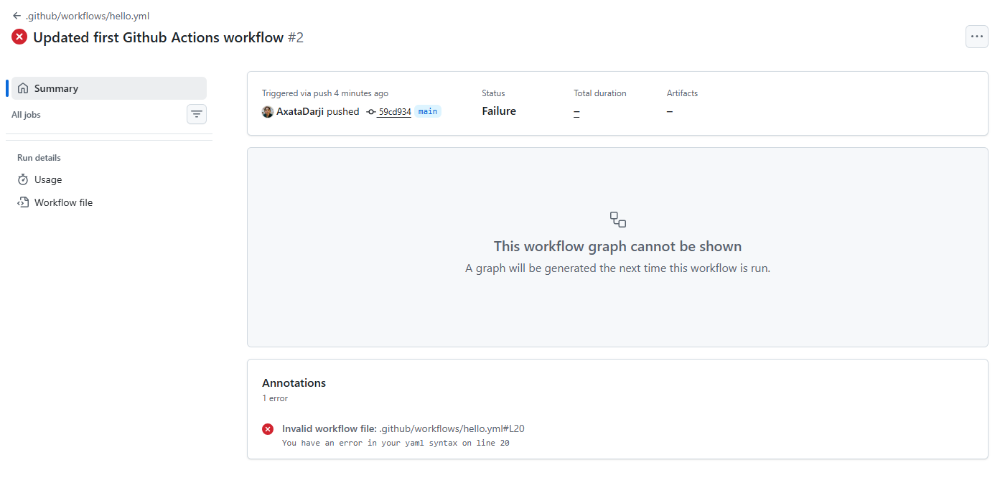

Task 3: Understand the Anatomy

Write down what each key in your YAML does:

    on: – defines events that trigger the workflow.
    jobs: – defines one or more jobs.
    runs-on: – specifies the runner OS.
    steps: – commands executed sequentially.
    uses: – calls a prebuilt GitHub Action.
    run: – runs shell commands.
    name: – description for the step.

Task 5:

