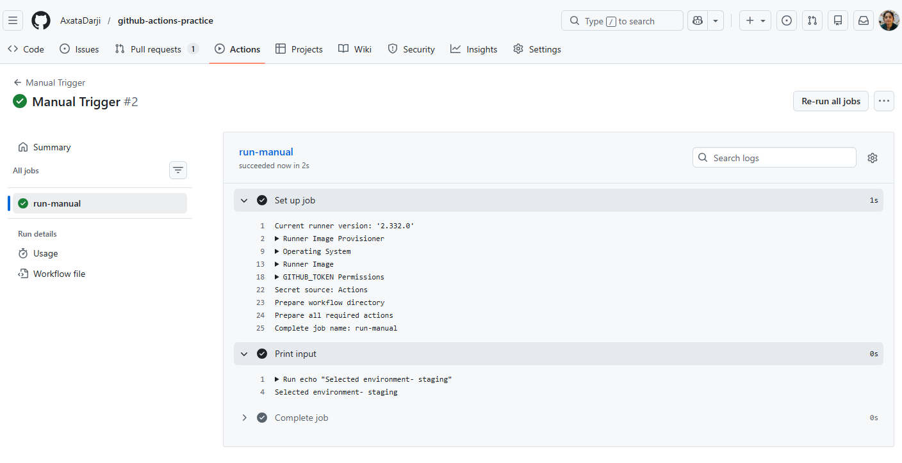

Task 2:
    Cron expression for every Monday at 9 AM UTC → 0 9 * * 1.

Task 3:
    

Task 5:
    fail-fast: true → cancels remaining jobs on first failure.
    fail-fast: false → other jobs continue running despite failure.