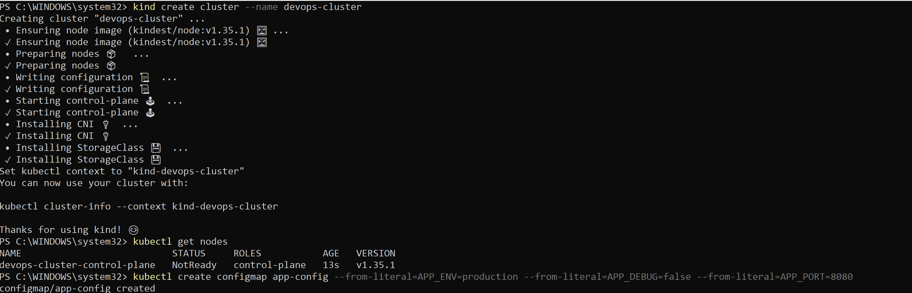
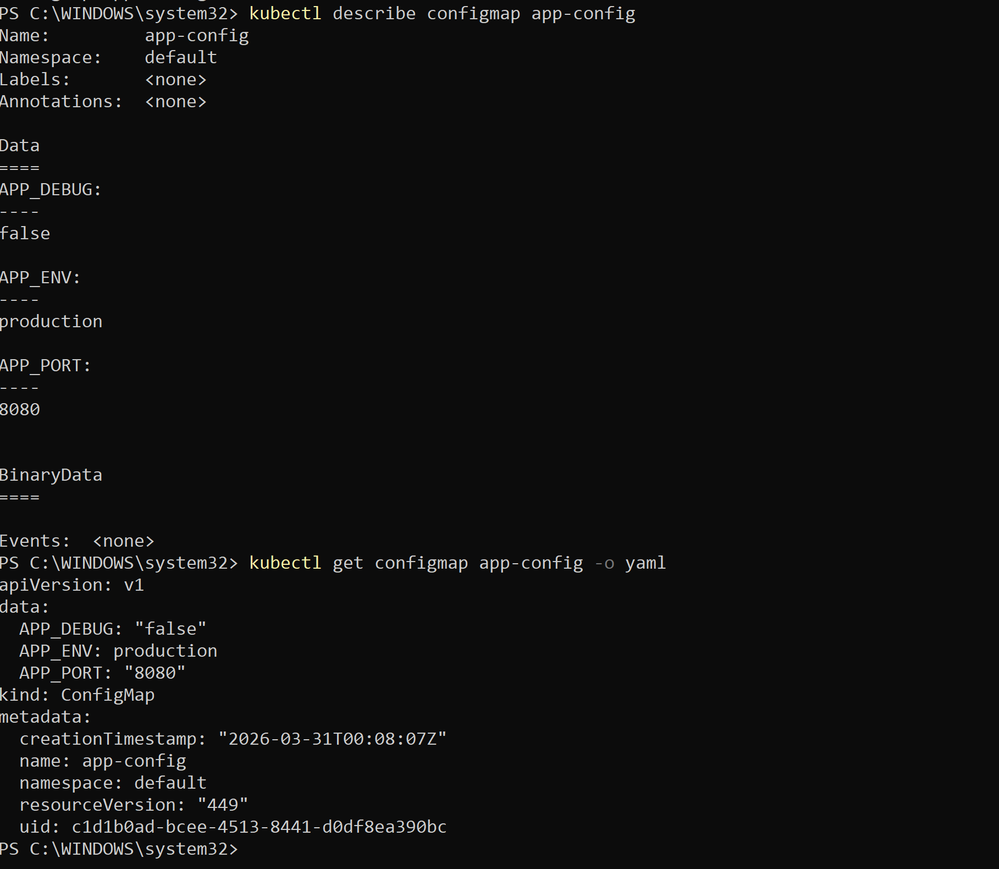
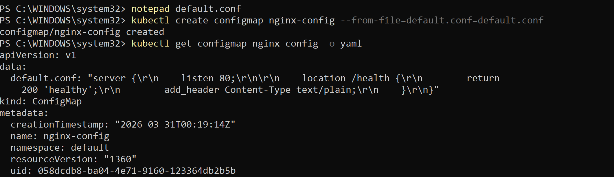
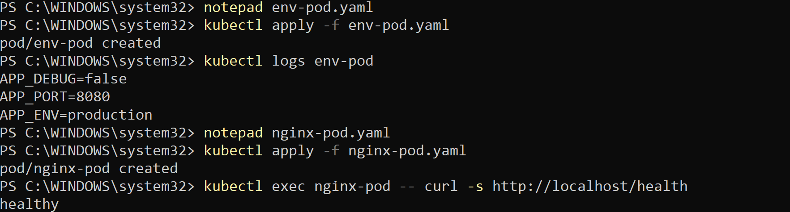
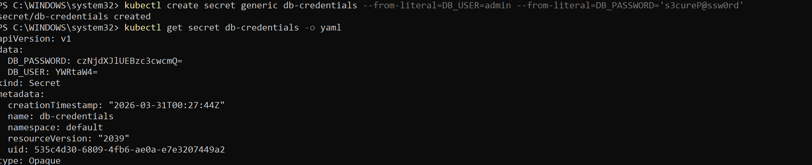
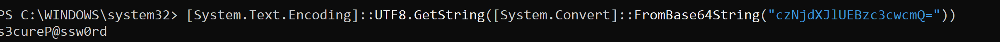

### Day 54 – Kubernetes ConfigMaps and Secrets

## Task:1  Create a ConfigMap from Literals
    1. Create ConfigMap
            kubectl create configmap app-config --from-literal=APP_ENV=production --from-literal=APP_DEBUG=false --from-literal=APP_PORT=8080

            
    2. Inspect
        kubectl describe configmap app-config
        kubectl get configmap app-config -o yaml

            

## Task:2  Create a ConfigMap from a File
    Step 1: Create Nginx config file
        notepad default.conf

        Paste this:

            server {
                listen 80;

                location /health {
                    return 200 'healthy';
                    add_header Content-Type text/plain;
                }
            }

    Step 2: Create ConfigMap
        kubectl create configmap nginx-config --from-file=default.conf=default.conf
        
    Step 3: Inspect
        kubectl get configmap nginx-config -o yaml

    

## Task:3  Use ConfigMaps in a Pod
    Pod 1: Environment Variables
        apiVersion: v1
        kind: Pod
        metadata:
        name: env-pod
        spec:
        containers:
        - name: busybox
            image: busybox
            command: ["sh", "-c", "env | grep APP && sleep 3600"]
            envFrom:
            - configMapRef:
                name: app-config

        Apply:
            kubectl apply -f env-pod.yaml
            kubectl logs env-pod

    Pod 2: Mount Config File (Nginx)
        apiVersion: v1
        kind: Pod
        metadata:
        name: nginx-pod
        spec:
        containers:
        - name: nginx
            image: nginx
            volumeMounts:
            - name: config-volume
            mountPath: /etc/nginx/conf.d
        volumes:
        - name: config-volume
            configMap:
            name: nginx-config

        Apply:
            kubectl apply -f nginx-pod.yaml

        Test Endpoint
            kubectl exec nginx-pod -- curl -s http://localhost/health

        

## Task:4  Create a Secret
    kubectl create secret generic db-credentials --from-literal=DB_USER=admin --from-literal=DB_PASSWORD='s3cureP@ssw0rd'

    Inspect:
        kubectl get secret db-credentials -o yaml
        

    Decode:
        [System.Text.Encoding]::UTF8.GetString([System.Convert]::FromBase64String("czNjdXJlUEBzc3cwcmQ="))

        

## Task:5  Use Secrets in a Pod
    apiVersion: v1
    kind: Pod
    metadata:
    name: secret-pod
    spec:
    containers:
    - name: busybox
        image: busybox
        command: ["sh", "-c", "env | grep DB && cat /etc/db-credentials/DB_PASSWORD && sleep 3600"]
        env:
        - name: DB_USER
        valueFrom:
            secretKeyRef:
            name: db-credentials
            key: DB_USER
        volumeMounts:
        - name: secret-volume
        mountPath: /etc/db-credentials
        readOnly: true
    volumes:
    - name: secret-volume
        secret:
        secretName: db-credentials

    Apply and check:
        kubectl apply -f secret-pod.yaml
        kubectl logs secret-pod

##  Task:6  Update a ConfigMap and Observe Propagation
    Create ConfigMap:

        kubectl create configmap live-config \
        --from-literal=message=hello
        Pod YAML
        apiVersion: v1
        kind: Pod
        metadata:
        name: live-pod
        spec:
        containers:
        - name: busybox
            image: busybox
            command: ["/bin/sh", "-c"]
            args:
            - while true; do cat /config/message; sleep 5; done
            volumeMounts:
            - name: config-volume
            mountPath: /config
        volumes:
        - name: config-volume
            configMap:
            name: live-config

    Apply :
        kubectl apply -f live-pod.yaml
        kubectl logs -f live-pod

    Update ConfigMap :
        kubectl patch configmap live-config --type merge -p '{"data":{"message":"world"}}'

## Task:7 Clean up
    kubectl delete pod env-pod nginx-pod secret-pod live-pod
    kubectl delete configmap app-config nginx-config live-config
    kubectl delete secret db-credentials