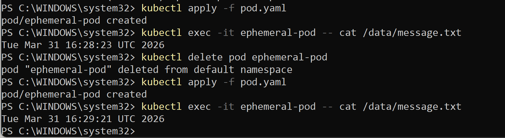
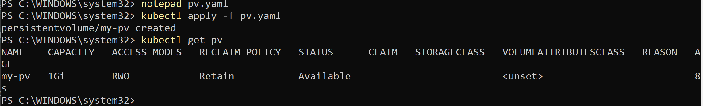
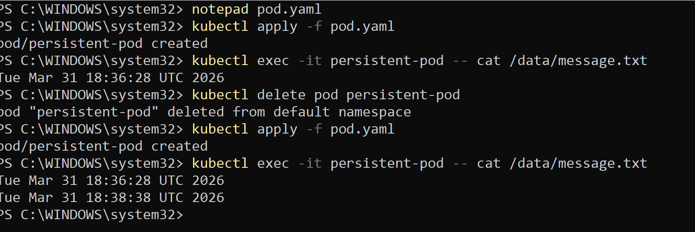
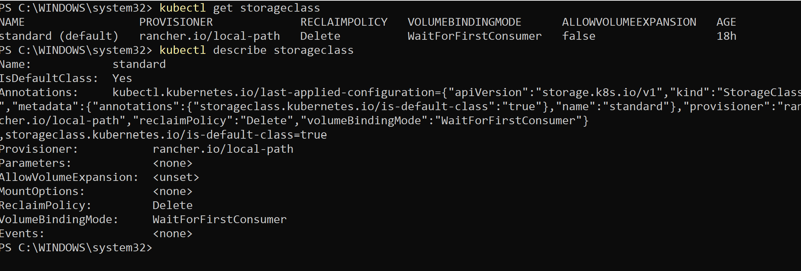
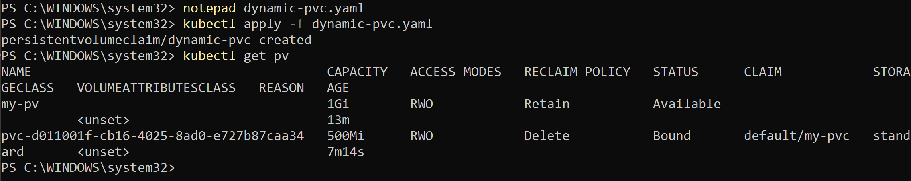

#  Day 55 – Persistent Volumes (PV) and Persistent Volume Claims (PVC)

##  Task

Containers are **ephemeral** — when a Pod dies, everything inside it disappears.
This is a major problem for databases and stateful applications.

Today, we solve this using:

* **Persistent Volumes (PV)**
* **Persistent Volume Claims (PVC)**

## Task 1: See the Problem — Data Lost on Pod Deletion

    ### Pod with `emptyDir`
        apiVersion: v1
        kind: Pod
        metadata:
        name: ephemeral-pod
        spec:
        containers:
        - name: app
            image: busybox
            command: ["/bin/sh", "-c"]
            args:
            - date >> /data/message.txt && sleep 3600
            volumeMounts:
            - name: temp-storage
            mountPath: /data
        volumes:
        - name: temp-storage
            emptyDir: {}

    ### Steps
        kubectl apply -f pod.yaml
        kubectl exec -it ephemeral-pod -- cat /data/message.txt
        kubectl delete pod ephemeral-pod
        kubectl apply -f pod.yaml
        kubectl exec -it ephemeral-pod -- cat /data/message.txt

    ### ✅ Verification

    * Timestamp is **different**
    * Old data is **lost**
    
    

## Task 2: Create a PersistentVolume (Static Provisioning)

    ### PV Manifest

        apiVersion: v1
        kind: PersistentVolume
        metadata:
        name: my-pv
        spec:
        capacity:
            storage: 1Gi
        accessModes:
            - ReadWriteOnce
        persistentVolumeReclaimPolicy: Retain
        hostPath:
            path: /mnt/data/k8s-pv-data

    ### Apply & Verify

        kubectl apply -f pv.yaml
        kubectl get pv

    ### Verification

    * STATUS: **Available**
        

## Task 3: Create a PersistentVolumeClaim

    ### PVC Manifest

        apiVersion: v1
        kind: PersistentVolumeClaim
        metadata:
        name: my-pvc
        spec:
        accessModes:
            - ReadWriteOnce
        resources:
            requests:
            storage: 500Mi

    ### Apply & Verify

        kubectl apply -f pvc.yaml
        kubectl get pvc
        kubectl get pv

## Task 4: Use PVC in a Pod (Persistent Data)

    ### Pod Manifest

        apiVersion: v1
        kind: Pod
        metadata:
        name: persistent-pod
        spec:
        containers:
        - name: app
            image: busybox
            command: ["/bin/sh", "-c"]
            args:
            - date >> /data/message.txt && sleep 3600
            volumeMounts:
            - mountPath: /data
            name: storage
        volumes:
        - name: storage
            persistentVolumeClaim:
            claimName: my-pvc

    ### Steps

        kubectl apply -f pod.yaml
        kubectl exec -it persistent-pod -- cat /data/message.txt
        kubectl delete pod persistent-pod
        kubectl apply -f pod.yaml
        kubectl exec -it persistent-pod -- cat /data/message.txt

    ### Verification

    * File contains **data from both Pods**
    * Data is **persisted**
    

##  Task 5: StorageClasses & Dynamic Provisioning

    ### Commands
        kubectl get storageclass
        kubectl describe storageclass

    ### Verification
    

---

## Task 6: Dynamic Provisioning

    ### PVC with StorageClass

        apiVersion: v1
        kind: PersistentVolumeClaim
        metadata:
        name: dynamic-pvc
        spec:
        accessModes:
            - ReadWriteOnce
        resources:
            requests:
            storage: 500Mi
        storageClassName: standard

    ### Apply & Verify
        kubectl apply -f dynamic-pvc.yaml
        kubectl get pv

    ### Verification

    * New PV created automatically
    * Count PVs:

    * 1 manual (static)
    * 1 dynamic
    

## Task 7: Cleanup

    ### Commands
    kubectl delete pod --all
    kubectl delete pvc --all
    kubectl get pv

    ### Verification

    * Dynamic PV → **Deleted**
    * Manual PV → **Released**

    kubectl delete pv my-pv

## Key Concepts

### Why Containers Need Persistent Storage

* Containers are temporary
* Data is lost on restart
* Stateful apps (DBs, logs) need durability

### What are PVs and PVCs?

| Component | Description                            |
| --------- | -------------------------------------- |
| PV        | Actual storage (cluster-wide resource) |
| PVC       | Request for storage (namespaced)       |

**Flow:**
PVC → binds → PV → used by Pod

### Static vs Dynamic Provisioning

| Type    | Description                                          |
| ------- | ---------------------------------------------------- |
| Static  | Admin creates PV manually                            |
| Dynamic | Kubernetes creates PV automatically via StorageClass |

### Access Modes

| Mode | Meaning                   |
| ---- | ------------------------- |
| RWO  | Read/Write by single node |
| ROX  | Read-only by many nodes   |
| RWX  | Read/Write by many nodes  |

### Reclaim Policies

| Policy | Behavior                      |
| ------ | ----------------------------- |
| Retain | Keeps data after PVC deletion |
| Delete | Deletes storage automatically |

##  Final Takeaway

* `emptyDir` = temporary storage 
* `PV + PVC` = persistent storage 
* Static = manual control
* Dynamic = automated provisioning

