Day 57 – Resource Requests, Limits, and Probes (Step-by-Step)

🔹 Task 1: Resource Requests & Limits
    Step 1: Create Pod YAML
        apiVersion: v1
        kind: Pod
        metadata:
        name: resource-pod
        spec:
        containers:
        - name: app
            image: nginx
            resources:
            requests:
                cpu: "100m"
                memory: "128Mi"
            limits:
                cpu: "250m"
                memory: "256Mi"
    Step 2: Apply Pod
        kubectl apply -f resource-pod.yaml
    Step 3: Verify
        kubectl describe pod resource-pod

    Check:
    Requests
    Limits
    QoS Class → Burstable
    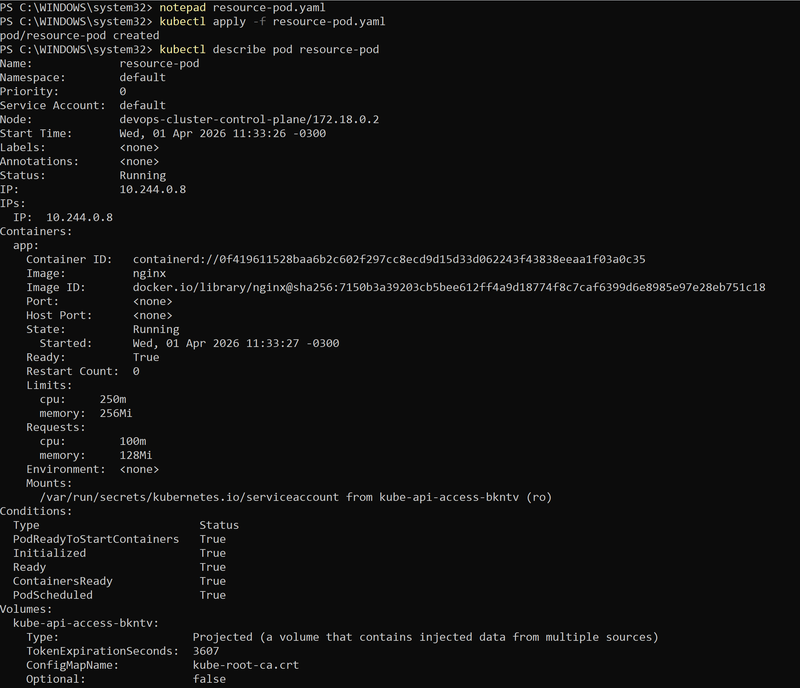
    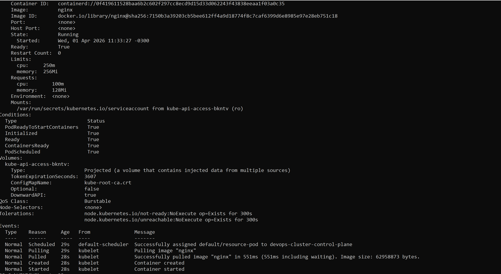

🔹 Task 2: OOMKilled (Memory Limit Exceeded)
    Step 1: Create YAML
        apiVersion: v1
        kind: Pod
        metadata:
        name: stress-pod
        spec:
        containers:
        - name: stress
            image: polinux/stress
            resources:
            limits:
                memory: "100Mi"
            command: ["stress"]
            args: ["--vm", "1", "--vm-bytes", "200M", "--vm-hang", "1"]
    Step 2: Apply
        kubectl apply -f stress-pod.yaml
    Step 3: Watch Pod
        kubectl get pod stress-pod -w
    Step 4: Describe
        kubectl describe pod stress-pod

    Look for:

    Reason: OOMKilled
    Exit Code: 137

    Answer: Exit code = 137
    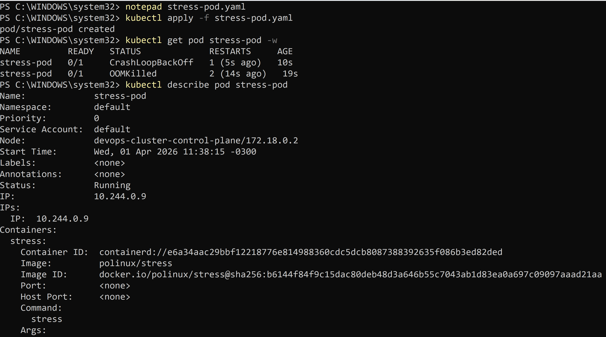
    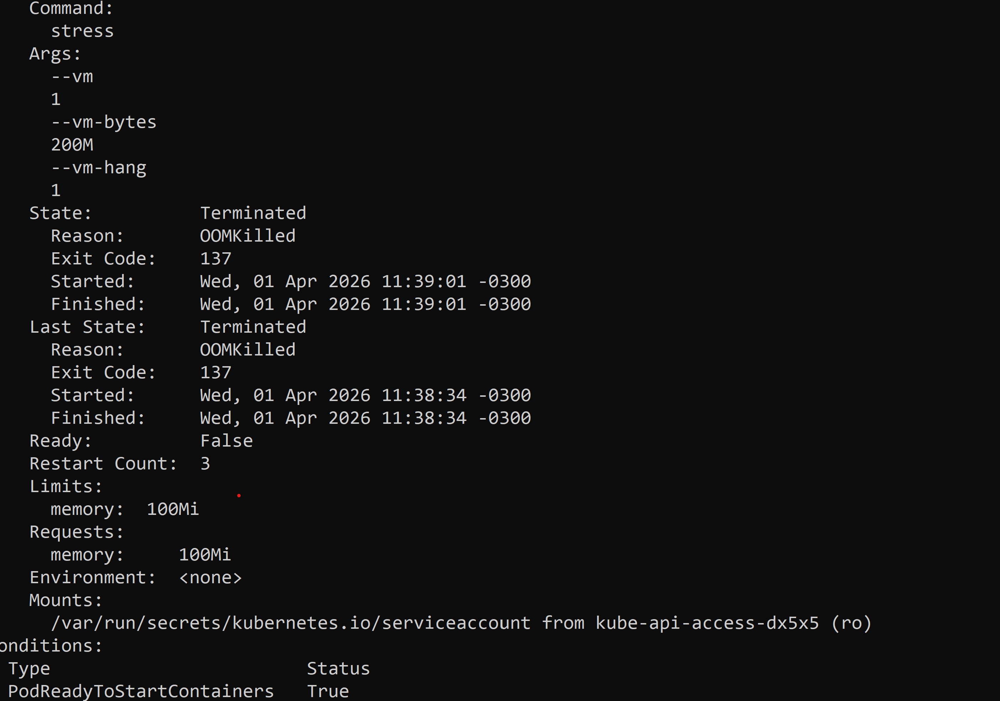

🔹 Task 3: Pending Pod (Too Many Resources)
    Step 1: Create YAML
        apiVersion: v1
        kind: Pod
        metadata:
        name: huge-pod
        spec:
        containers:
        - name: big
            image: nginx
            resources:
            requests:
                cpu: "100"
                memory: "128Gi"
    Step 2: Apply
        kubectl apply -f huge-pod.yaml
    Step 3: Check Status
        kubectl get pod huge-pod

    STATUS = Pending

    Step 4: Describe
        kubectl describe pod huge-pod

    Look in Events:
        0/1 nodes are available: insufficient cpu, insufficient memory

    Answer: Scheduler message = Insufficient resources
    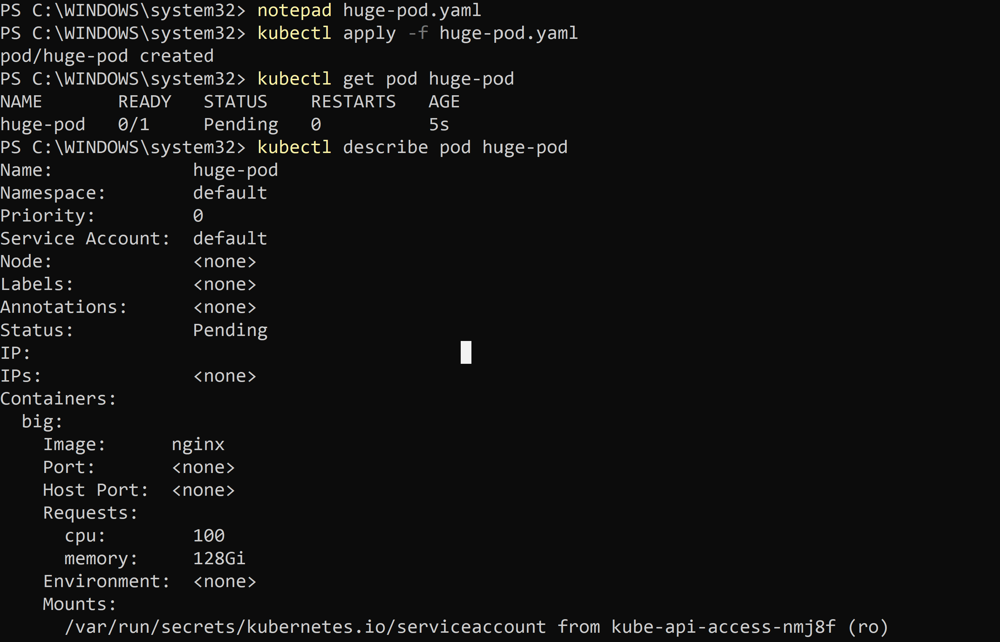
    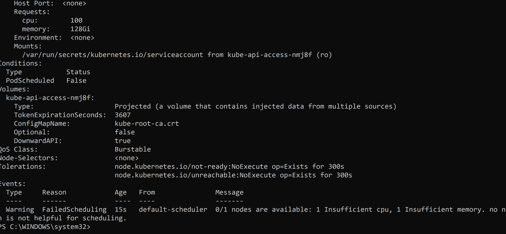

🔹 Task 4: Liveness Probe
    Step 1: Create YAML
        apiVersion: v1
        kind: Pod
        metadata:
        name: liveness-pod
        spec:
        containers:
        - name: busybox
            image: busybox
            command: ["/bin/sh", "-c"]
            args:
            - touch /tmp/healthy;
                sleep 30;
                rm -f /tmp/healthy;
                sleep 600;
            livenessProbe:
            exec:
                command:
                - cat
                - /tmp/healthy
            periodSeconds: 5
            failureThreshold: 3
    Step 2: Apply
        kubectl apply -f liveness-pod.yaml
    Step 3: Watch Restarts
        kubectl get pod liveness-pod -w

    After ~30 sec:
        File deleted
        Probe fails 3 times
        Pod restarts
        Step 4: Verify
        kubectl describe pod liveness-pod

    Check:
        Restart count increases

🔹 Task 5: Readiness Probe
    Step 1: Create YAML
        apiVersion: v1
        kind: Pod
        metadata:
        name: readiness-pod
        spec:
        containers:
        - name: nginx
            image: nginx
            readinessProbe:
            httpGet:
                path: /
                port: 80
            periodSeconds: 5
    Step 2: Apply
        kubectl apply -f readiness-pod.yaml
    Step 3: Expose Service
        kubectl expose pod readiness-pod --port=80 --name=readiness-svc
    Step 4: Check Endpoints
        kubectl get endpoints readiness-svc
    Step 5: Break Readiness
        kubectl exec readiness-pod -- rm /usr/share/nginx/html/index.html
    Step 6: Observe
        kubectl get pod readiness-pod
        kubectl get endpoints readiness-svc

    Results:
        READY → 0/1
        Endpoints → empty
        Container → NOT restarted

    Answer: No restart
    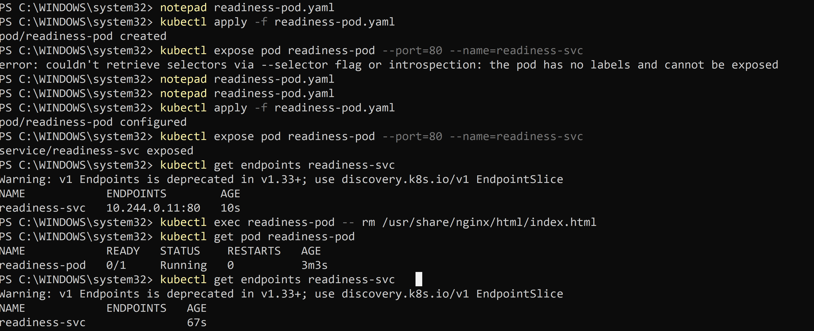

🔹 Task 6: Startup Probe
    Step 1: Create YAML
        apiVersion: v1
        kind: Pod
        metadata:
        name: startup-pod
        spec:
        containers:
        - name: app
            image: busybox
            command: ["/bin/sh", "-c"]
            args:
            - sleep 20; touch /tmp/started; sleep 600
            startupProbe:
            exec:
                command:
                - cat
                - /tmp/started
            periodSeconds: 5
            failureThreshold: 12
            livenessProbe:
            exec:
                command:
                - cat
                - /tmp/started
            periodSeconds: 5
    Step 2: Apply
        kubectl apply -f startup-pod.yaml
    Step 3: Observe
        kubectl describe pod startup-pod

    Behavior:
        Startup probe runs first
        Liveness waits until startup succeeds

    Answer:
        If failureThreshold = 2 → Pod would restart too early (before app starts)
    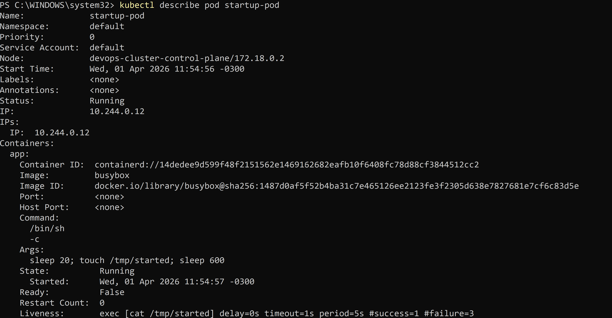
    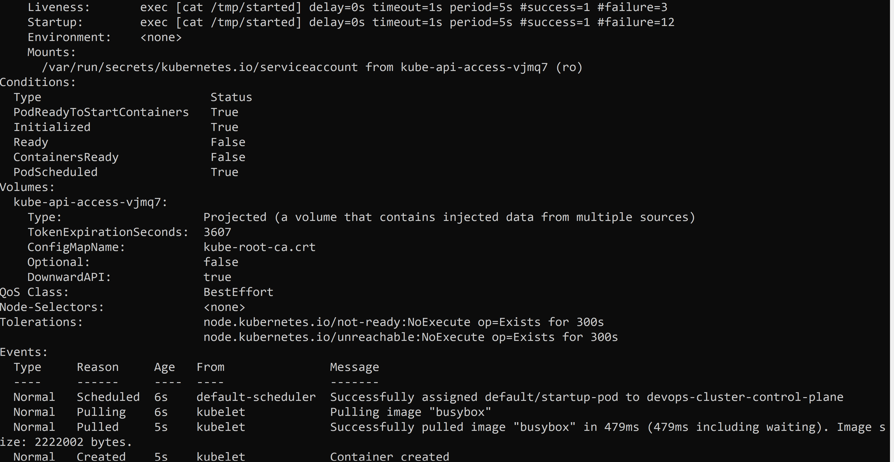
    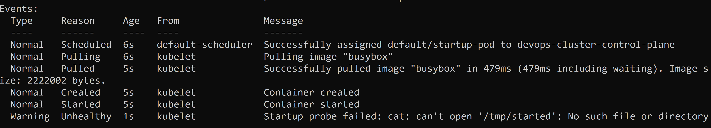

🔹 Task 7: Cleanup
    kubectl delete pod resource-pod
    kubectl delete pod stress-pod
    kubectl delete pod huge-pod
    kubectl delete pod liveness-pod
    kubectl delete pod readiness-pod
    kubectl delete pod startup-pod
    kubectl delete svc readiness-svc
    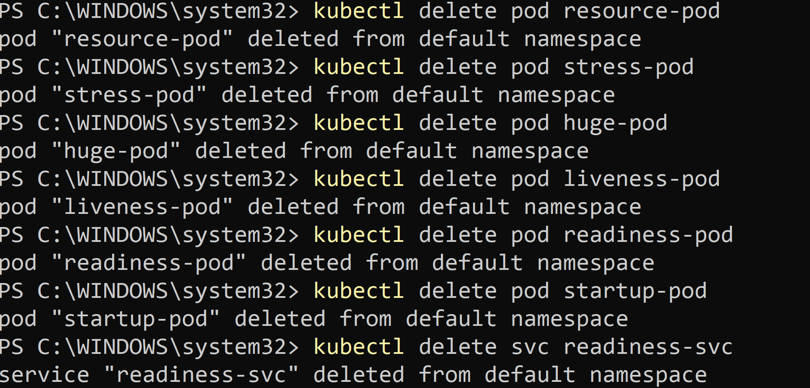

🔥 Key Takeaways (Important for Interview)
    Requests → Scheduling
    Limits → Enforcement
    CPU → Throttled
    Memory → OOMKilled
    QoS Classes
        Guaranteed → requests = limits
        Burstable → requests < limits
        BestEffort → none set
    Probes
        Liveness → Restart container
        Readiness → Remove from traffic
        Startup → Delay liveness/readiness
