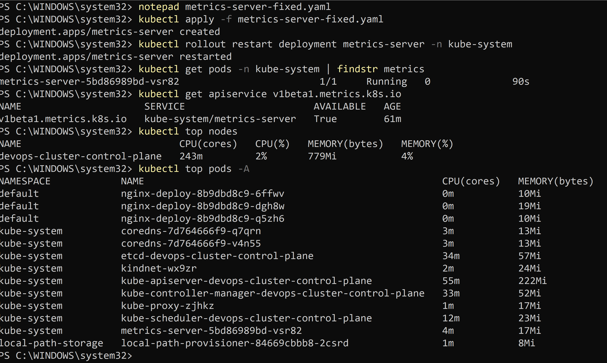
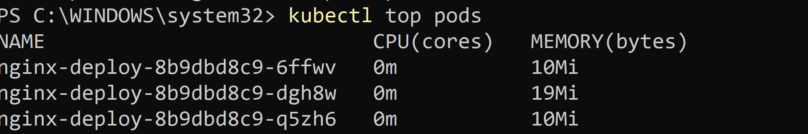
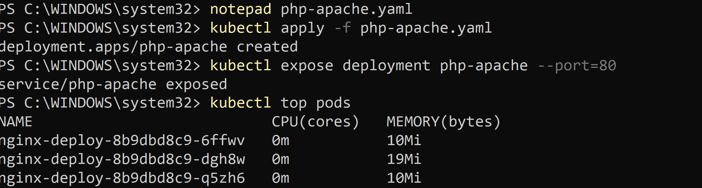
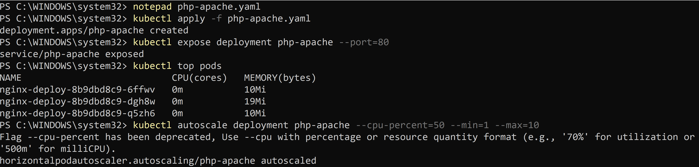
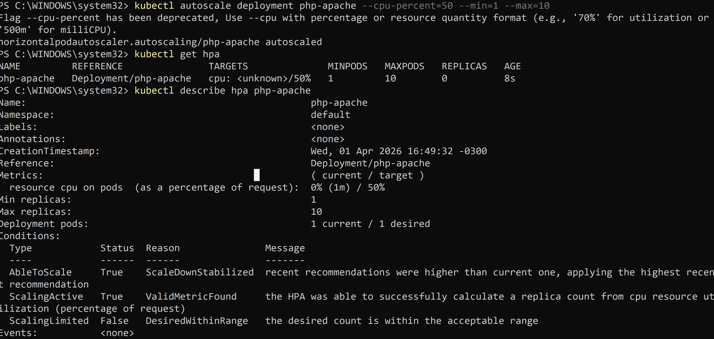
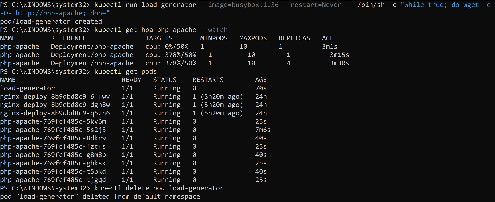
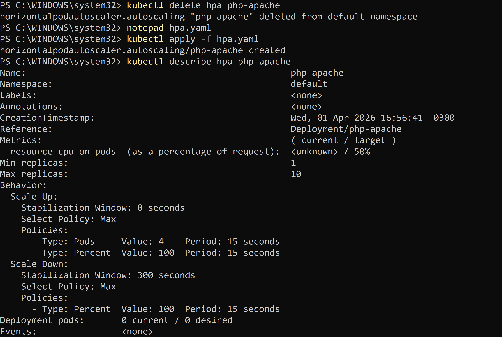
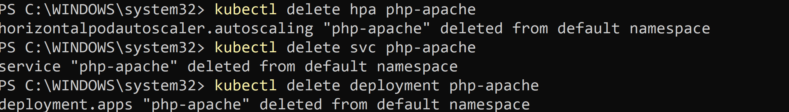

🚀 Day 58 – Task-wise Step-by-Step Guide
🔹 Task 1: Verify Metrics Server is Installed
        Step 1:
        kubectl apply -f https://github.com/kubernetes-sigs/metrics-server/releases/latest/download/components.yaml
        notepad metrics-server-fixed.yaml
        Content of yaml file:
            apiVersion: apps/v1
            kind: Deployment
            metadata:
            name: metrics-server
            namespace: kube-system  
            labels:
                k8s-app: metrics-server
            spec:
            selector:
                matchLabels:
                k8s-app: metrics-server
            replicas: 1
            template:
                metadata:
                labels:
                    k8s-app: metrics-server
                spec:
                serviceAccountName: metrics-server
                containers:
                - name: metrics-server
                    image: registry.k8s.io/metrics-server/metrics-server:v0.8.1
                    args:
                    - --cert-dir=/tmp
                    - --secure-port=4443
                    - --kubelet-insecure-tls
                    - --kubelet-preferred-address-types=InternalIP,ExternalIP,Hostname
                    - --metric-resolution=15s
                    ports:
                    - containerPort: 4443
                    name: https
                    resources:
                    requests:
                        cpu: 100m
                        memory: 200Mi
                    volumeMounts:
                    - mountPath: /tmp
                    name: tmp-dir
                volumes:
                - name: tmp-dir
                    emptyDir: {}
        
        Apply the file:
            kubectl apply -f metrics-server-fixed.yaml
            kubectl rollout restart deployment metrics-server -n kube-system

        Step 2:
        kubectl get pods -n kube-system
        ✔ Expected:
        metrics-server pod should be Running
        Step 3: Verify Metrics API
        kubectl top nodes
        kubectl top pods
        
        
    

🔹 Task 2: Check Current CPU Usage
     Run:
        kubectl top pods
       

🔹 Task 3: Create Deployment with CPU Requests
        Step 1: Create file php-apache.yaml
            apiVersion: apps/v1
            kind: Deployment
            metadata:
            name: php-apache
            spec:
            replicas: 1
            selector:
                matchLabels:
                app: php-apache
            template:
                metadata:
                labels:
                    app: php-apache
                spec:
                containers:
                - name: php-apache
                    image: registry.k8s.io/hpa-example
                    ports:
                    - containerPort: 80
                    resources:
                    requests:
                        cpu: 200m
         Step 2: Apply
            kubectl apply -f php-apache.yaml
         Step 3: Expose Service
            kubectl expose deployment php-apache --port=80
         Step 4: Check CPU
            kubectl top pods
        

🔹 Task 4: Create HPA (Imperative)
        Run:
            kubectl autoscale deployment php-apache --cpu-percent=50 --min=1 --max=10
        Check:
            kubectl get hpa
            kubectl describe hpa php-apache
        Wait 30–60 sec
        
        

🔹 Task 5: Generate Load & Watch Autoscaling
        Step 1: Generate Load
        kubectl run load-generator \
        --image=busybox:1.36 \
        --restart=Never \
        -- /bin/sh -c "while true; do wget -q -O- http://php-apache; done"
        
        Step 2: Watch HPA
        kubectl get hpa php-apache --watch
        
        Step 3: Check Pods (new terminal)
        kubectl get pods
        
        What happens:
        CPU increases
        TARGETS > 50%
        Pods scale automatically

        Step 4: Stop Load
        kubectl delete pod load-generator
        

🔹 Task 6: Create HPA (Declarative - YAML)
        Step 1: Delete old HPA
        kubectl delete hpa php-apache
        
        Step 2: Create file hpa.yaml
            apiVersion: autoscaling/v2
            kind: HorizontalPodAutoscaler
            metadata:
            name: php-apache
            spec:
            scaleTargetRef:
                apiVersion: apps/v1
                kind: Deployment
                name: php-apache
            minReplicas: 1
            maxReplicas: 10
            metrics:
            - type: Resource
                resource:
                name: cpu
                target:
                    type: Utilization
                    averageUtilization: 50
            behavior:
                scaleUp:
                stabilizationWindowSeconds: 0
                scaleDown:
                stabilizationWindowSeconds: 300
        
        Step 3: Apply
        kubectl apply -f hpa.yaml
        
        Step 4: Verify
        kubectl describe hpa php-apache
        

🔹 Task 7: Cleanup
        kubectl delete svc php-apache
        kubectl delete deployment php-apache
        kubectl delete pod load-generator
        

🎯 Final Quick Answers (Interview Ready)
Metrics Server → provides CPU/memory metrics
kubectl top → real-time usage
HPA formula → scaling based on CPU %
TARGETS → current vs desired utilization
autoscaling/v2 → advanced + production-ready
behavior → controls scaling speed