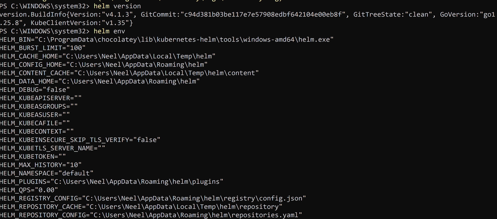
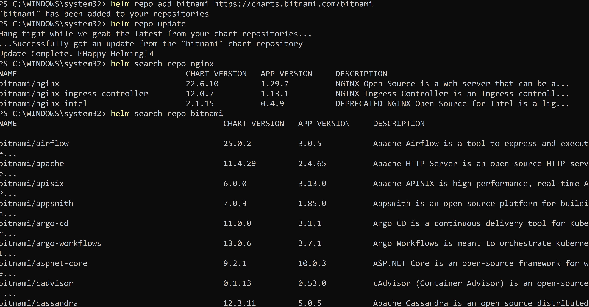
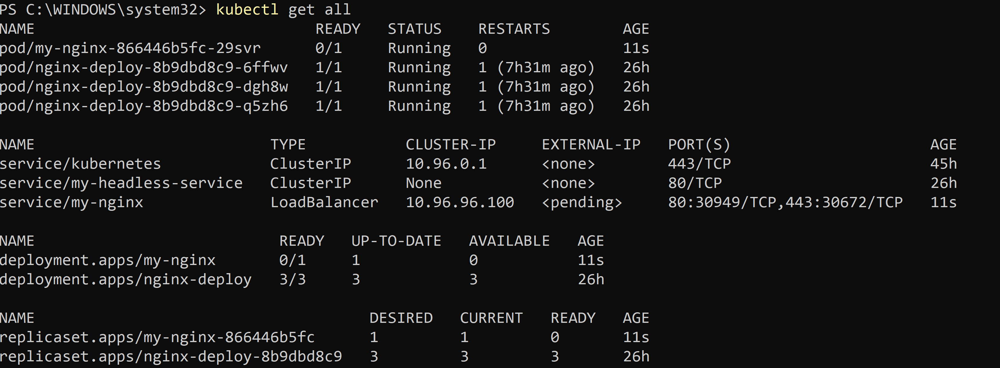
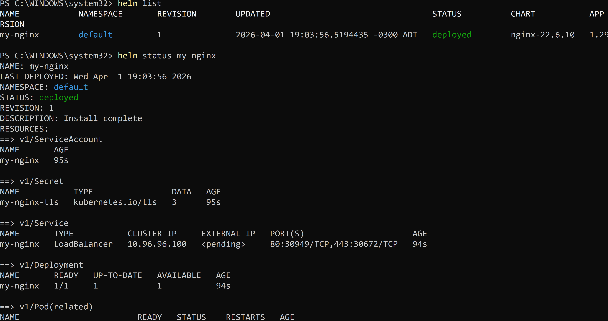
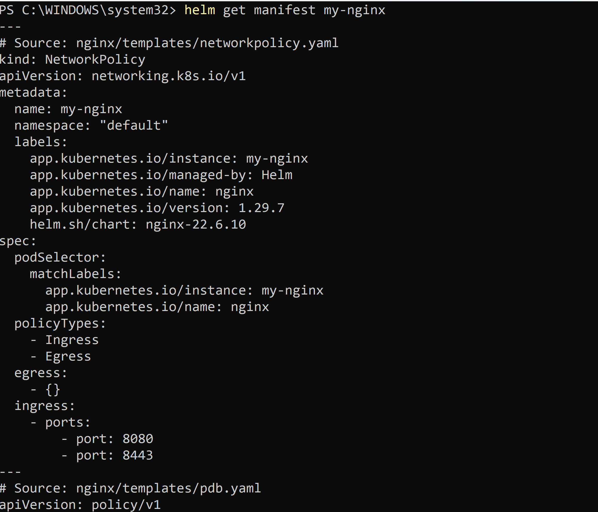
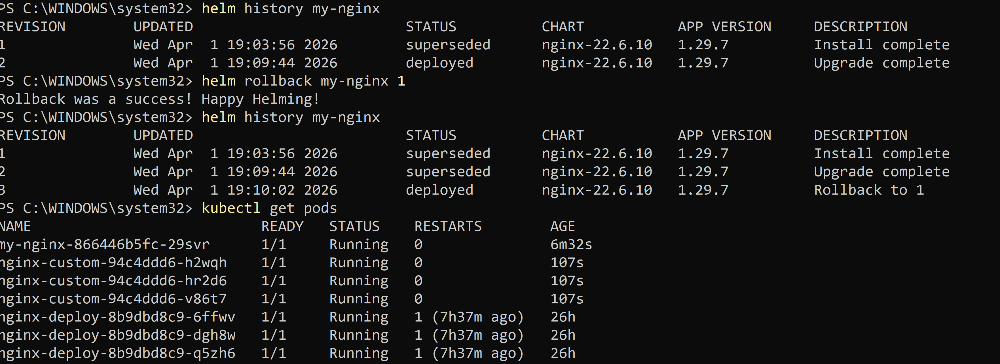
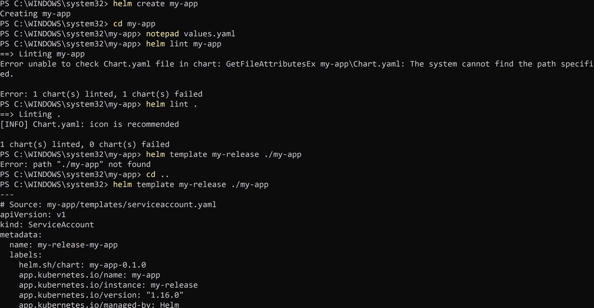
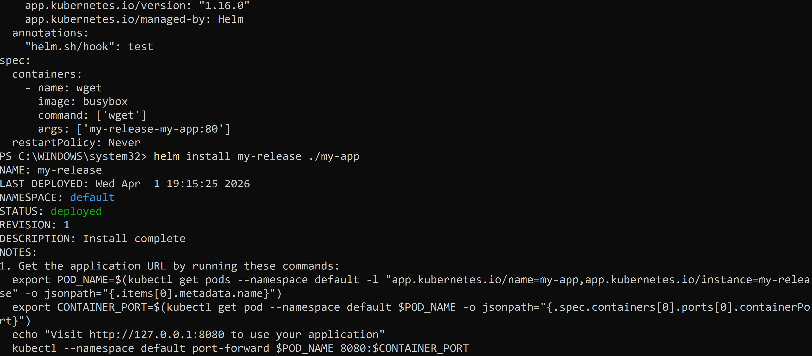
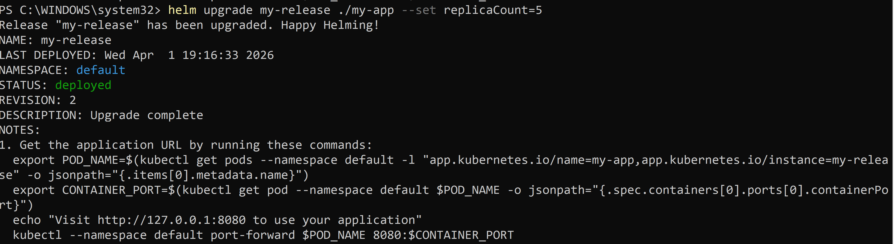
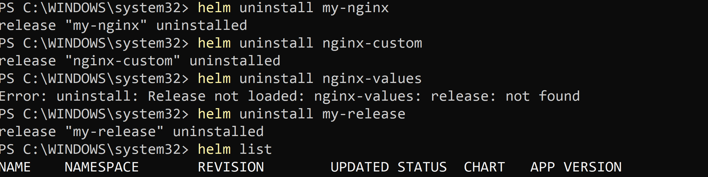

# 🚀 Day 59 -- Helm --- Kubernetes Package Manager (Detailed Guide)

## 📌 What is Helm?

Helm is a package manager for Kubernetes that helps you define, install,
and manage applications using charts.

------------------------------------------------------------------------

## 🔑 Core Concepts

-   **Chart** → Collection of Kubernetes YAML templates
-   **Release** → Running instance of a chart
-   **Repository** → Collection of charts

------------------------------------------------------------------------

# 🔹 Task 1: Install Helm

## Install (Windows - Chocolatey)

    choco install kubernetes-helm -y

## Three core concepts:

    Chart — a package of Kubernetes manifest templates
    Release — a specific installation of a chart in your cluster
    Repository — a collection of charts (like a package repo)

## Verify

    helm version
    helm env
    
------------------------------------------------------------------------

# 🔹 Task 2: Add Repository and Search

    helm repo add bitnami https://charts.bitnami.com/bitnami
    helm repo update
    helm search repo nginx
    helm search repo bitnami
    

    Bitnami typically has 200+ charts

------------------------------------------------------------------------

# 🔹 Task 3: Install Chart

    helm install my-nginx bitnami/nginx
    kubectl get all
    
    helm list
    helm status my-nginx
    
    helm get manifest my-nginx
    
------------------------------------------------------------------------

# 🔹 Task 4: Customize Values

## View Defaults

    helm show values bitnami/nginx

## Inline Override

    helm install nginx-custom bitnami/nginx \
    --set replicaCount=3 \
    --set service.type=NodePort

## custom-values.yaml

    replicaCount: 3

    service:
      type: NodePort

    resources:
      limits:
        cpu: "200m"
        memory: "256Mi"

## Install with file

    helm install nginx-values bitnami/nginx -f custom-values.yaml
    helm get values nginx-values

------------------------------------------------------------------------

# 🔹 Task 5: Upgrade and Rollback

    helm upgrade my-nginx bitnami/nginx --set replicaCount=5
    helm history my-nginx
    helm rollback my-nginx 1
    helm history my-nginx
    

------------------------------------------------------------------------

# 🔹 Task 6: Create Custom Chart

    helm create my-app
    cd my-app

## Update values.yaml

    replicaCount: 3

    image:
      repository: nginx
      tag: "1.25"

## Validate & Install

    helm lint my-app
    helm template my-release ./my-app
    
    helm install my-release ./my-app
    
    helm upgrade my-release ./my-app --set replicaCount=5
    

------------------------------------------------------------------------

# 🔹 Task 7: Cleanup

    helm uninstall my-nginx
    helm uninstall nginx-custom
    helm uninstall nginx-values
    helm uninstall my-release
    helm list
    
------------------------------------------------------------------------

# 🧠 Key Commands Cheat Sheet

    helm install <name> <chart>
    helm upgrade <name> <chart>
    helm rollback <name> <revision>
    helm uninstall <name>

    helm list
    helm history <name>

    helm show values <chart>
    helm get values <release>

    helm lint <chart>
    helm template <chart>

------------------------------------------------------------------------

# 🎯 Summary

Helm simplifies Kubernetes deployments by packaging resources into
reusable charts, enabling easy install, upgrade, rollback, and
customization.
