# Day 60 – Capstone: Deploy WordPress + MySQL on Kubernetes

## Overview

This capstone brings together everything learned over 10 days of Kubernetes:
Namespaces, Pods, Deployments, Services, ConfigMaps, Secrets, Persistent Volumes, StatefulSets, Resource Management, Probes, HPA, and Helm.

We will deploy a production-like **WordPress + MySQL stack** inside a dedicated namespace called `capstone`.

---

## Architecture

```
WordPress (Deployment, 2 replicas)
        |
        |  (Service: NodePort)
        v
MySQL (StatefulSet, mysql-0)
        |
        |  (Headless Service)
        v
Persistent Volume (PVC 1Gi)
```

### Key Components Mapping

* WordPress → Deployment + NodePort Service
* MySQL → StatefulSet + Headless Service + PVC
* Config → ConfigMap
* Secrets → MySQL credentials
* Scaling → HPA

---

## Task 1: Create Namespace

    kubectl create namespace capstone
    kubectl config set-context --current --namespace=capstone
    kubectl get ns
    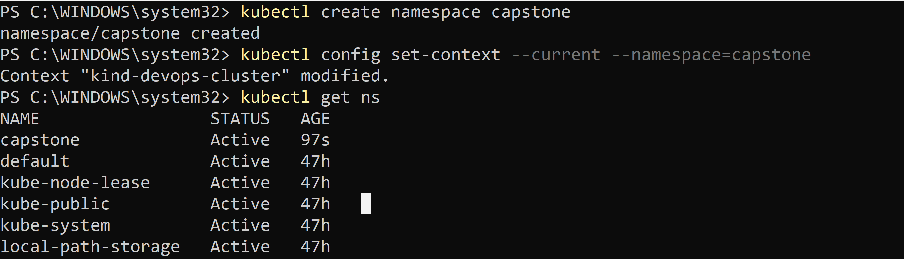

## Task 2: MySQL Setup (StatefulSet)

### 1. Secret

    apiVersion: v1
    kind: Secret
    metadata:
    name: mysql-secret
    type: Opaque
    stringData:
    MYSQL_ROOT_PASSWORD: rootpass
    MYSQL_DATABASE: wordpress
    MYSQL_USER: wpuser
    MYSQL_PASSWORD: wppass

    Apply:
    kubectl apply -f mysql-secret.yaml


### 2. Headless Service

    apiVersion: v1
    kind: Service
    metadata:
    name: mysql
    spec:
    clusterIP: None
    ports:
        - port: 3306
    selector:
        app: mysql


### 3. StatefulSet
    apiVersion: apps/v1
    kind: StatefulSet
    metadata:
    name: mysql
    spec:
    serviceName: mysql
    replicas: 1
    selector:
        matchLabels:
        app: mysql
    template:
        metadata:
        labels:
            app: mysql
        spec:
        containers:
            - name: mysql
            image: mysql:8.0
            envFrom:
                - secretRef:
                    name: mysql-secret
            ports:
                - containerPort: 3306
            resources:
                requests:
                cpu: "250m"
                memory: "512Mi"
                limits:
                cpu: "500m"
                memory: "1Gi"
            volumeMounts:
                - name: mysql-storage
                mountPath: /var/lib/mysql
    volumeClaimTemplates:
        - metadata:
            name: mysql-storage
        spec:
            accessModes: ["ReadWriteOnce"]
            resources:
            requests:
                storage: 1Gi

    Apply:
    kubectl apply -f mysql-statefulset.yaml
    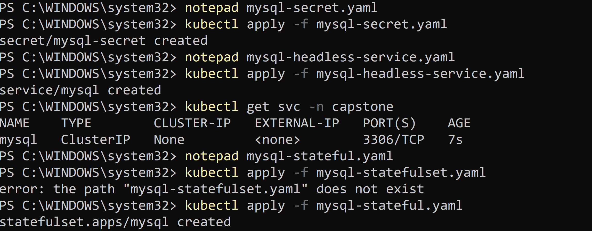

### Verify MySQL

    kubectl get pods
    kubectl logs mysql-0

    kubectl exec -it mysql-0 -- mysql -u wpuser -pwppass -e "SHOW DATABASES;"

    Expected DB: `wordpress`
    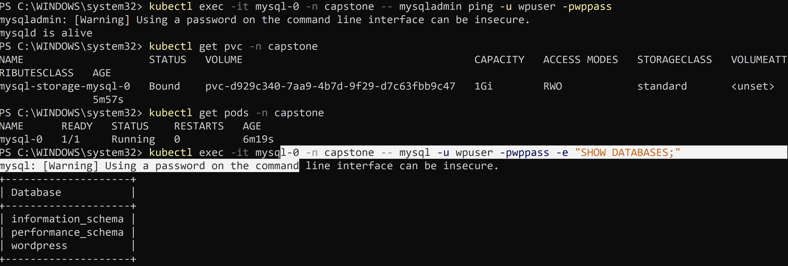


##  Task 3: Deploy WordPress

### ConfigMap

    apiVersion: v1
    kind: ConfigMap
    metadata:
    name: wordpress-config
    data:
    WORDPRESS_DB_HOST: mysql-0.mysql.capstone.svc.cluster.local:3306
    WORDPRESS_DB_NAME: wordpress

### Deployment

    apiVersion: apps/v1
    ind: Deployment
    metadata:
    name: wordpress
    spec:
    replicas: 2
    selector:
        matchLabels:
        app: wordpress
    template:k
        metadata:
        labels:
            app: wordpress
        spec:
        containers:
            - name: wordpress
            image: wordpress:latest
            envFrom:
                - configMapRef:
                    name: wordpress-config
            env:
                - name: WORDPRESS_DB_USER
                valueFrom:
                    secretKeyRef:
                    name: mysql-secret
                    key: MYSQL_USER
                - name: WORDPRESS_DB_PASSWORD
                valueFrom:
                    secretKeyRef:
                    name: mysql-secret
                    key: MYSQL_PASSWORD
            ports:
                - containerPort: 80
            resources:
                requests:
                cpu: "200m"
                memory: "256Mi"
                limits:
                cpu: "500m"
                memory: "512Mi"
            livenessProbe:
                httpGet:
                path: /wp-login.php
                port: 80
                initialDelaySeconds: 30
                periodSeconds: 10
            readinessProbe:
                httpGet:
                path: /wp-login.php
                port: 80
                initialDelaySeconds: 10
                periodSeconds: 5

    Apply:

    kubectl apply -f wordpress-deployment.yaml
    kubectl get pods -w
    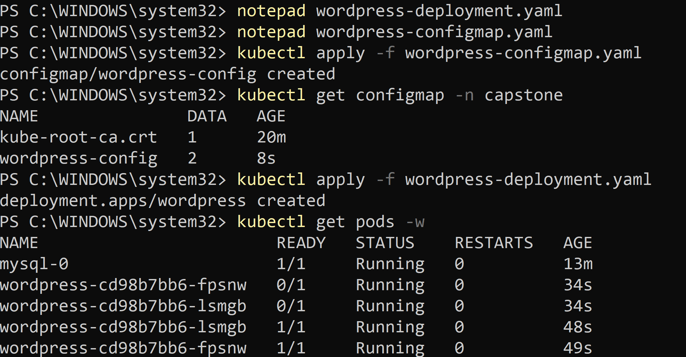

##  Task 4: Expose WordPress

### NodePort Service

    apiVersion: v1
    kind: Service
    metadata:
    name: wordpress
    spec:
    type: NodePort
    selector:
        app: wordpress
    ports:
        - port: 80
        targetPort: 80
        nodePort: 30080

    Apply:
    kubectl apply -f wordpress-service.yaml

### Access
    kubectl port-forward svc/wordpress 8080:80 -n capstone

    Open:
    http://localhost:8080
    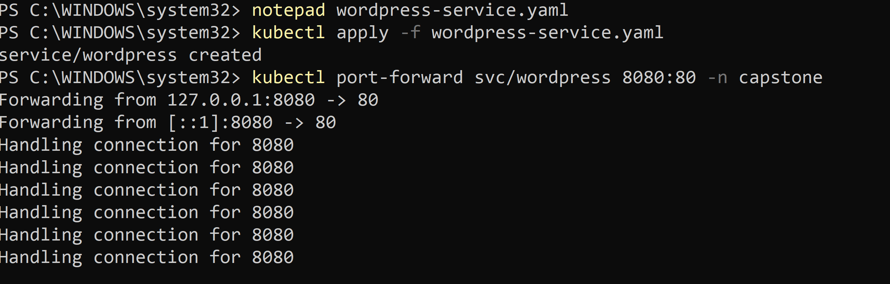
    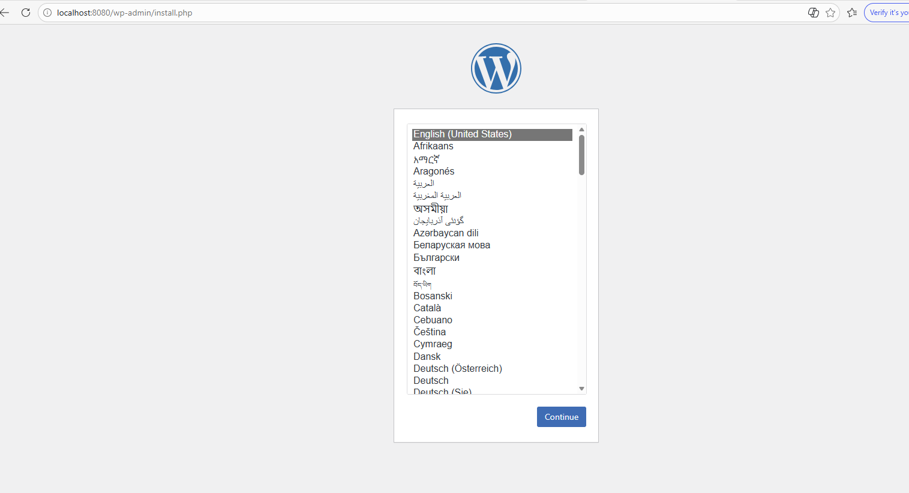
    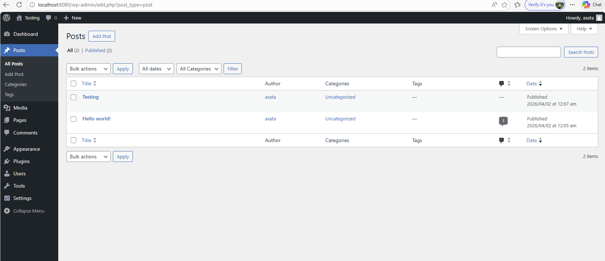

## 🔄 Task 5: Self-Healing & Persistence

### Test WordPress recovery
    kubectl delete pod -l app=wordpress
    kubectl get pods -w

### Test MySQL recovery
    kubectl delete pod mysql-0
    kubectl get pods -w
    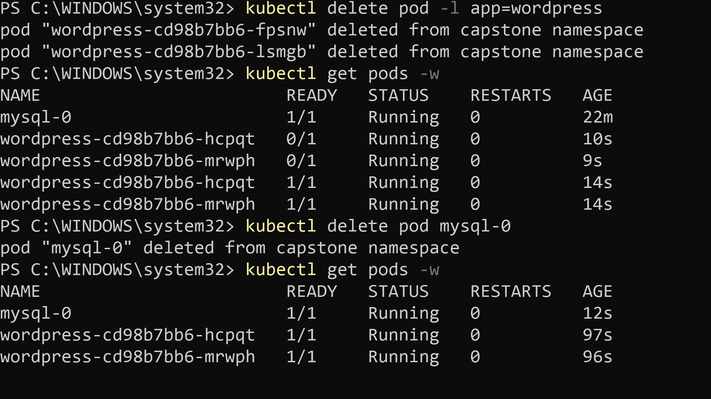

### Verify persistence

* Refresh WordPress site
* Blog post should still exist
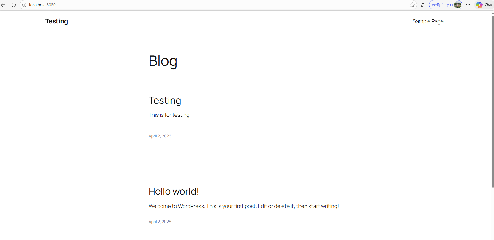
---

## Task 6: HPA Setup

    apiVersion: autoscaling/v2
    kind: HorizontalPodAutoscaler
    metadata:
    name: wordpress-hpa
    spec:
    scaleTargetRef:
        apiVersion: apps/v1
        kind: Deployment
        name: wordpress
    minReplicas: 2
    maxReplicas: 10
    metrics:
        - type: Resource
        resource:
            name: cpu
            target:
            type: Utilization
            averageUtilization: 50

    Apply:
        kubectl apply -f hpa.yaml
        kubectl get hpa
        kubectl get all
    
    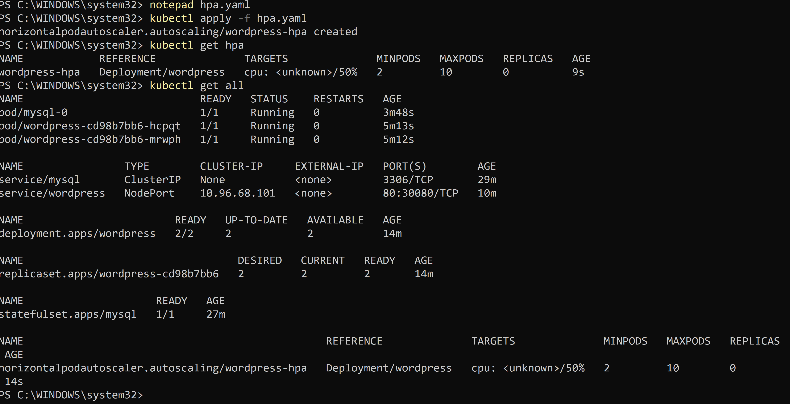

## Task 7: Helm Comparison

    helm repo add bitnami https://charts.bitnami.com/bitnami
    helm install wp-helm bitnami/wordpress -n helm-demo --create-namespace
    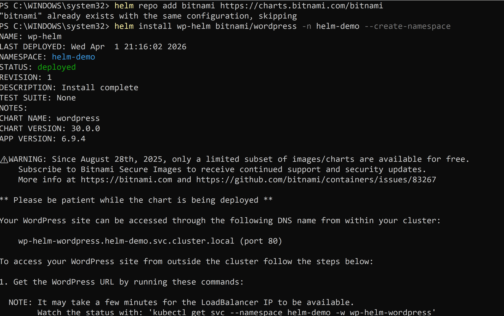

### Observation

* Helm auto-created Deployment, Service, PVC, Secret
* Faster provisioning vs manual control

---

## Task 8: Cleanup
kubectl get all -n capstone
kubectl delete namespace capstone
kubectl config set-context --current --namespace=default

Verify:

* All resources deleted

---

## Concept Usage Summary

| Concept          | Usage Day |
| ---------------- | --------- |
| Namespace        | Day 52    |
| Secret           | Day 54    |
| ConfigMap        | Day 54    |
| PVC              | Day 55    |
| StatefulSet      | Day 56    |
| Headless Service | Day 56    |
| Deployment       | Day 52    |
| NodePort Service | Day 53    |
| Resource Limits  | Day 57    |
| Probes           | Day 57    |
| HPA              | Day 58    |
| Helm             | Day 59    |

---

## Reflection

### What was hardest?

* MySQL DNS resolution inside cluster
* Debugging readiness probes

### What clicked?

* StatefulSets vs Deployments
* Service discovery via DNS

### What would I improve in production?

* Use managed DB (RDS/CloudSQL)
* Use Ingress instead of NodePort
* Add TLS (cert-manager)
* External secret management

---

## Final Result

A fully working Kubernetes-native WordPress stack with:

* Self-healing
* Persistent storage
* Autoscaling
* Secure configuration
* Production-ready architecture patterns
