# 🚀 Day 61 – Introduction to Terraform and Your First AWS Infrastructure

## Understand Infrastructure as Code
    ##  What is Infrastructure as Code (IaC)?
        Infrastructure as Code (IaC) is the practice of managing and provisioning infrastructure using code instead of manual processes. It allows developers to define cloud resources like servers, networks, and storage in configuration files.

        IaC is important in DevOps because it enables automation, consistency, and version control. Instead of manually creating resources in AWS, we can define everything in code and reproduce environments easily.

    ##  Why IaC Matters
        - Eliminates manual errors
        - Ensures consistent environments
        - Enables version control (Git)
        - Faster and automated deployments

    ##  Problems Solved by IaC
        Without IaC:
            - Manual configuration errors
            - Difficult to replicate environments
            - No tracking of changes

        With IaC:
            - Repeatable deployments
            - Easy rollback
            - Team collaboration

    ##  Terraform vs Other Tools
        | Tool        | Type       | Description |
        |-------------|------------|-------------|
        | Terraform   | Declarative| Multi-cloud IaC |
        | CloudFormation| Declarative | AWS-specific |
        | Ansible     | Procedural | Configuration management |
        | Pulumi      | Declarative | Uses programming languages |

    ## Key Concepts
        - **Declarative**: Define *what* you want, Terraform decides *how*
        - **Cloud-agnostic**: Works across AWS, Azure, GCP

##  Install Terraform and Configure AWS

    ## Install Terraform
        choco install 
        
    ## Verify Terraform
        terraform -version

    ## Install and configure the AWS CLI
        aws configure
    
    ## Verify AWS access
        aws sts get-caller-identity
    
    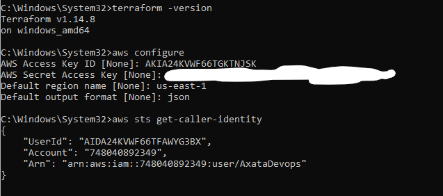

## Your first Terraform Config -- Create an S3 Bucket

    ## ☁️ Terraform Configuration Example (main.tf)

        # 🔧 Terraform block
        terraform {
        required_providers {
            aws = {
            source  = "hashicorp/aws"
            version = "~> 5.0"
            }
        }
        }

        # 🌍 AWS Provider
        provider "aws" {
        region = "us-east-1"  # Change if needed
        }

        # 🪣 S3 Bucket (must be globally unique)
        resource "aws_s3_bucket" "my_bucket" {
        bucket = "axata-terraform-bucket" 
        tags = {
            Name        = "MyFirstTerraformBucket"
            Environment = "Dev"
        }
        }

    ### Initialize Terraform
        terraform init
        - Downloads provider plugins
        - Creates `.terraform/` directory

    ### Plan Infrastructure
        terraform plan
        - Shows what changes will be made
        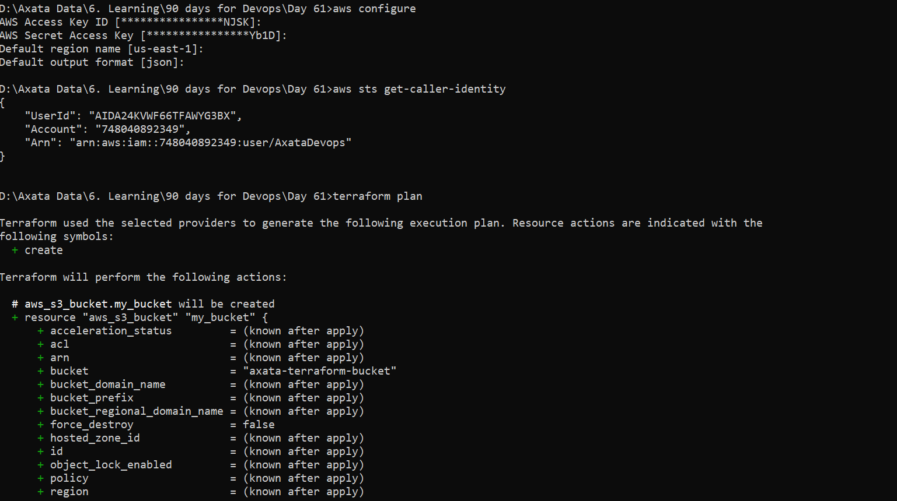

    ### Apply Changes
        terraform apply
        - Creates resources in AWS
        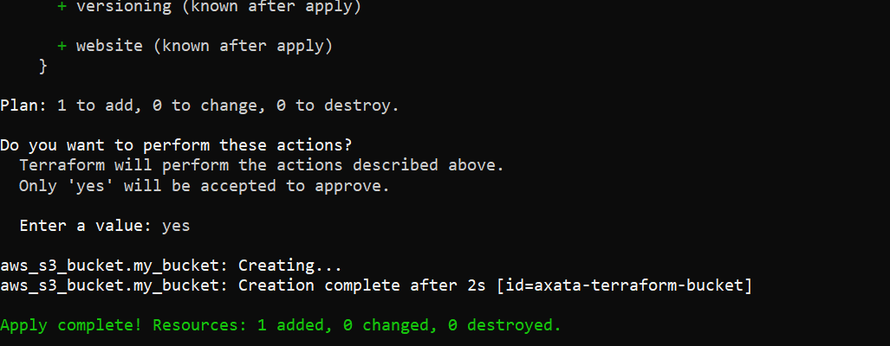
        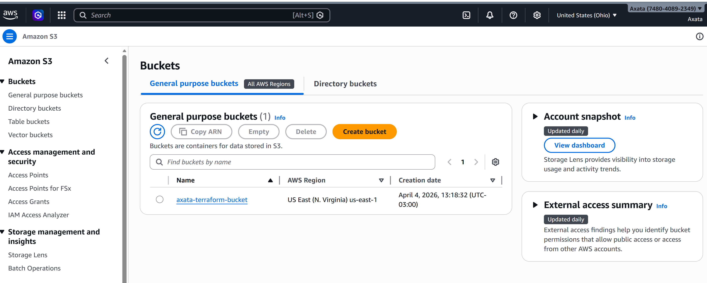

    ### Destroy Resources
    terraform destroy
    - Deletes all resources created by Terraform
     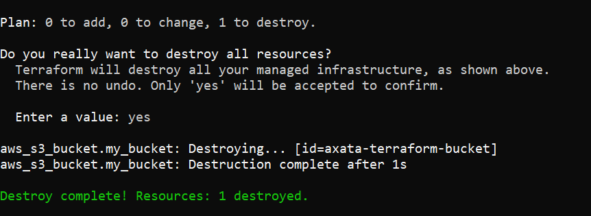

    ### Show State
        terraform show

    ### List Resources
        terraform state list

## Add an EC2 Instance
    ### Updated config file
        # 🔧 Terraform block
        terraform {
        required_providers {
            aws = {
            source  = "hashicorp/aws"
            version = "~> 5.0"
            }
        }
        }

        # AWS Provider
        provider "aws" {
        region = "us-east-1"  # Change if needed
        }

        # S3 Bucket (must be globally unique)
        resource "aws_s3_bucket" "my_bucket" {
        bucket = "axata-terraform-bucket" 
        tags = {
            Name        = "MyFirstTerraformBucket"
            Environment = "Dev"
        }
        }

        # EC2 Instance
        resource "aws_instance" "my_ec2" {
        ami           = "ami-0c02fb55956c7d316" 
        instance_type = "t3.micro"

        tags = {
            Name = "TerraWeek-Day1"
        }
        }

        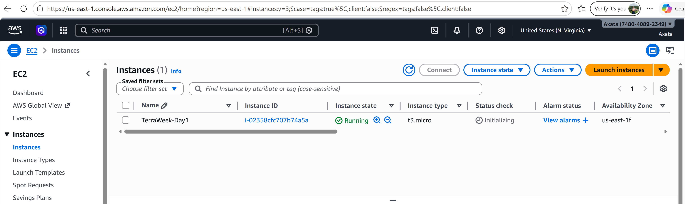
        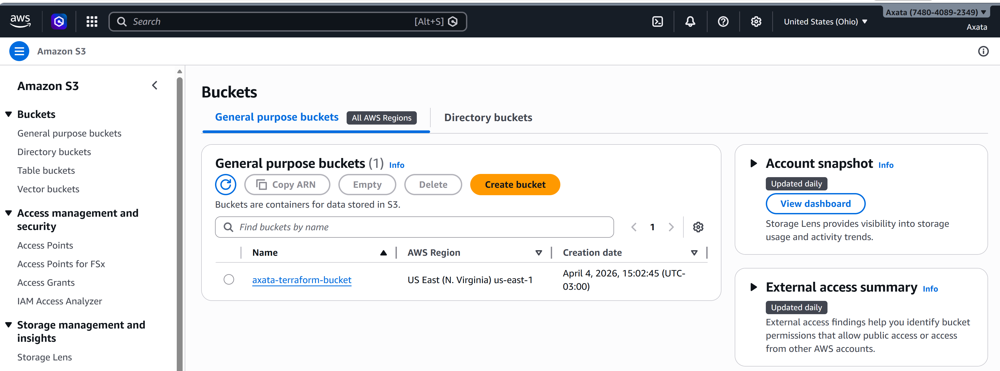

### Understand the State file
    ## Show state
        terraform show
        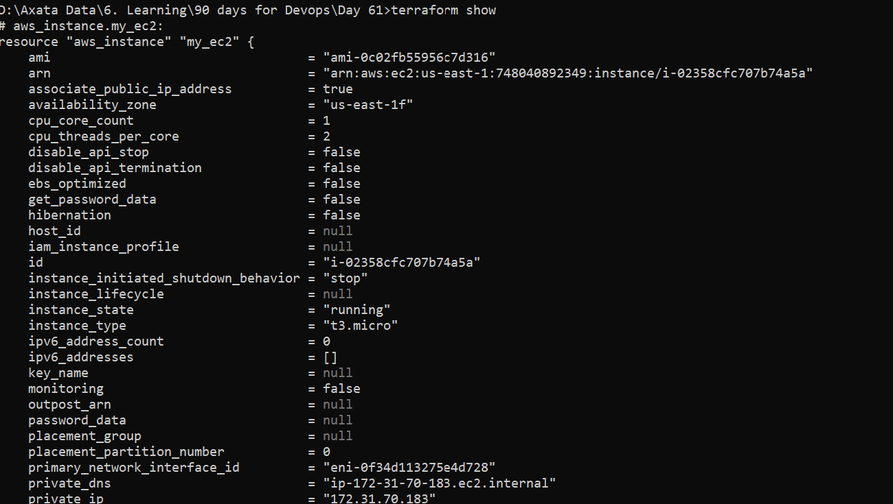
        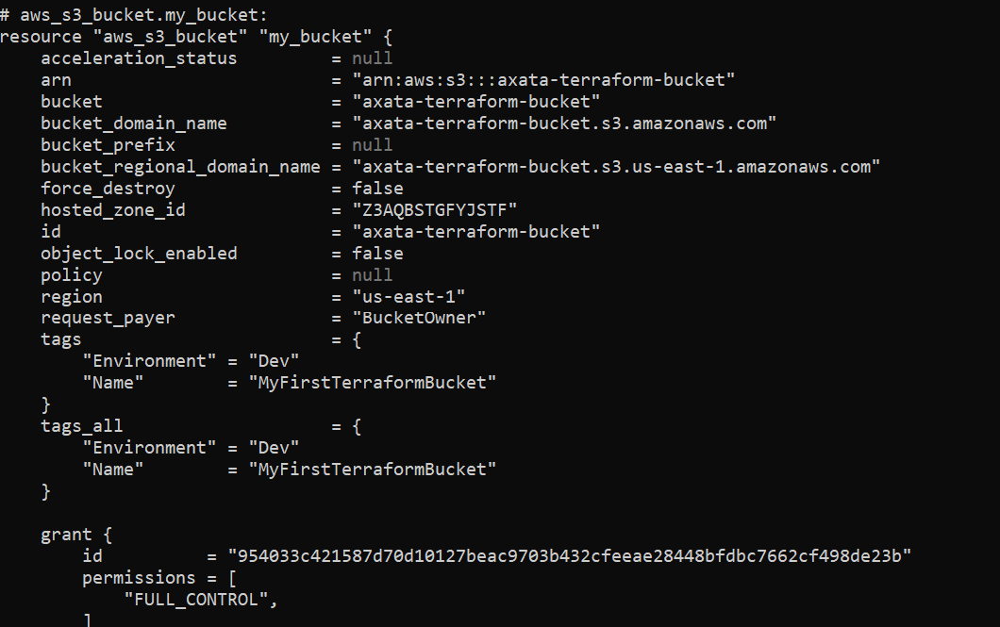
    
    ## List resources
        terraform state list
        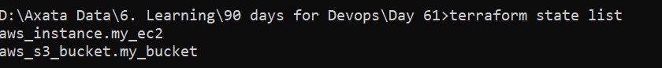

    ## Specific resource
        terraform state show aws_s3_bucket.my_bucket
        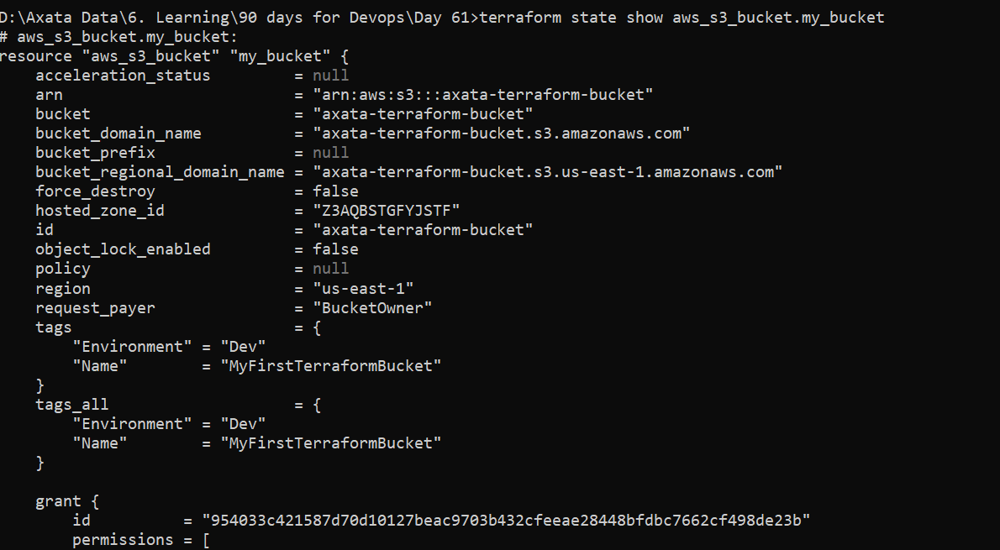
        terraform state show aws_instance.
        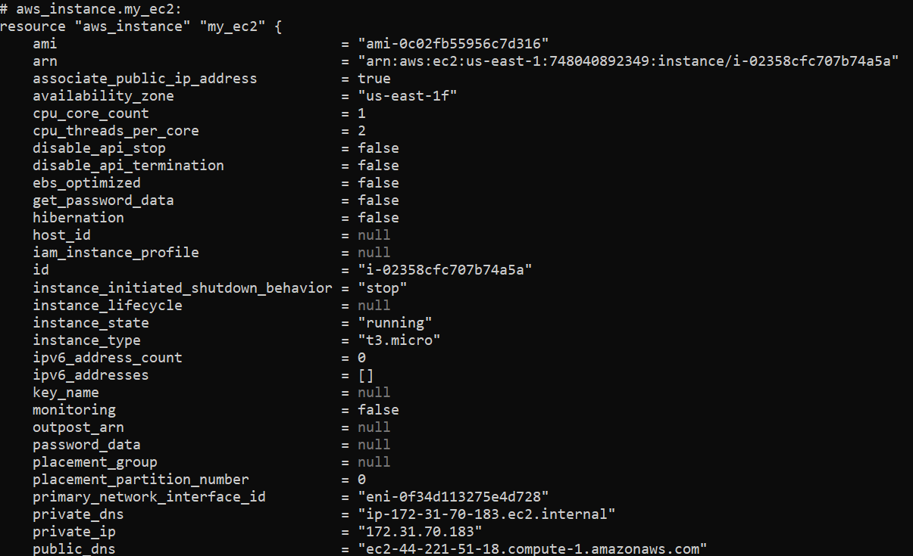
    
    
## 📂 Terraform State File

    ### What it Contains:
    - Resource IDs
    - ARNs
    - Metadata
    - Current infrastructure state

    ### Why Important:
    - Tracks real infrastructure
    - Helps Terraform detect changes

    ### Why NOT edit manually:
    - Can break infrastructure tracking
    - Leads to inconsistencies

    ### Why NOT commit to Git:
    - Contains sensitive information
    - Security risks

## 🔄 Resource Lifecycle Symbols

    | Symbol | Meaning |
    |--------|--------|
    | + | Create |
    | ~ | Modify |
    | - | Destroy |

    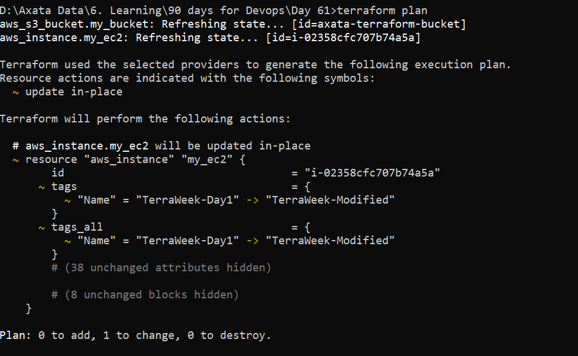
    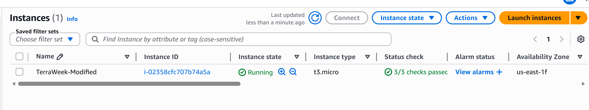
