🚀 Day 62 – Providers, Resources & Dependencies (Step-by-Step)

## Task 1: Explore the AWS Provider
    ## Step 1: Create Project Folder
    mkdir terraform-aws-infra
    cd terraform-aws-infra
    
    ## Step 2: Create providers.tf
    terraform {
    required_providers {
        aws = {
        source  = "hashicorp/aws"
        version = "~> 5.0"
        }
    }
    }

    provider "aws" {
    region = "us-east-1"   # change if needed
    }
    
    ## Step 3: Initialize Terraform
    terraform init
    
    Observe:
    Provider downloaded (e.g., 5.x.x)
    .terraform.lock.hcl created
    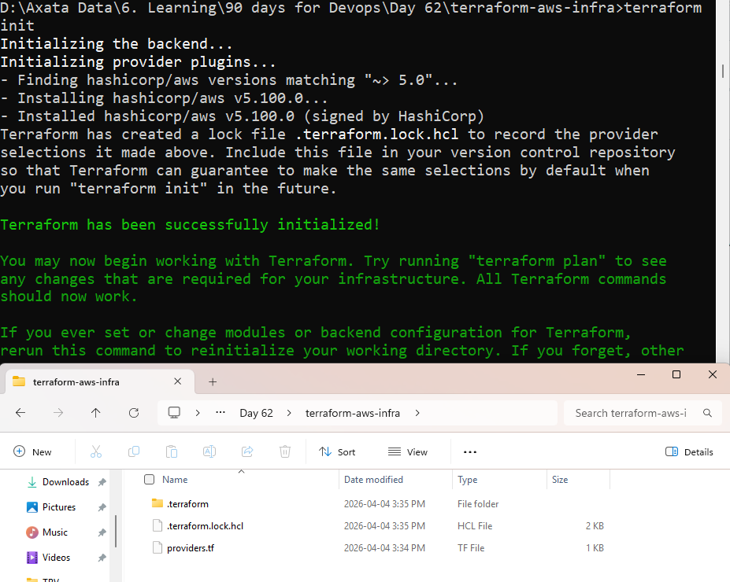
    
    ## Step 4: Understand Lock File
    .terraform.lock.hcl:
        Locks provider versions
        Ensures consistent builds across machines
    
    ## Step 5: Version Constraints Explained
    Constraint	Meaning
        ~> 5.0	Allows 5.x but NOT 6.0
        >= 5.0	Allows anything 5.0 and above
        = 5.0.0	Strict exact version
        Best practice: use ~> for stability + flexibility

## Task 2: Build VPC from Scratch
    ## Step 1: Create main.tf
        🔸 VPC
        resource "aws_vpc" "main" {
        cidr_block = "10.0.0.0/16"

        tags = {
            Name = "TerraWeek-VPC"
        }
        }
        🔸 Subnet
        resource "aws_subnet" "public" {
        vpc_id                  = aws_vpc.main.id
        cidr_block              = "10.0.1.0/24"
        map_public_ip_on_launch = true

        tags = {
            Name = "TerraWeek-Public-Subnet"
        }
        }
        🔸 Internet Gateway
        resource "aws_internet_gateway" "igw" {
        vpc_id = aws_vpc.main.id
        }
        🔸 Route Table
        resource "aws_route_table" "rt" {
        vpc_id = aws_vpc.main.id
        }
        🔸 Route
        resource "aws_route" "default" {
        route_table_id         = aws_route_table.rt.id
        destination_cidr_block = "0.0.0.0/0"
        gateway_id             = aws_internet_gateway.igw.id
        }
        🔸 Route Table Association
        resource "aws_route_table_association" "rta" {
        subnet_id      = aws_subnet.public.id
        route_table_id = aws_route_table.rt.id
        }
    
    ## Step 2: Run Plan
        terraform plan
        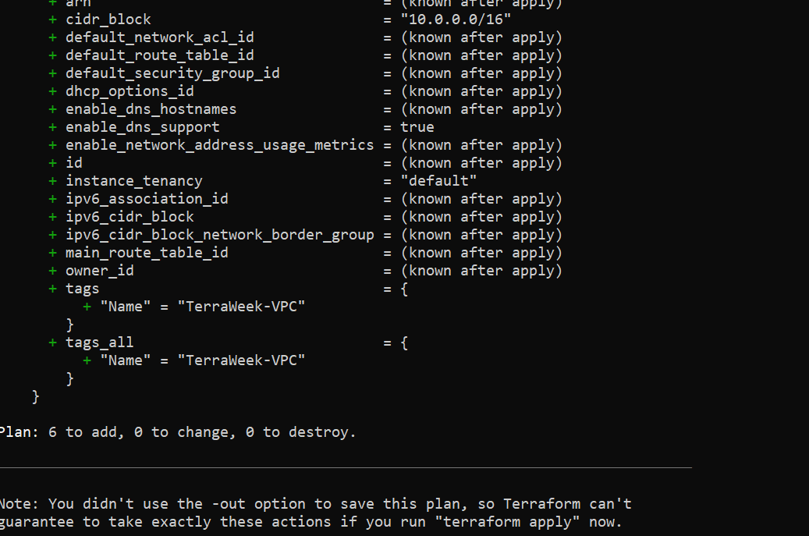

    ## Step 3: Apply
        terraform apply
        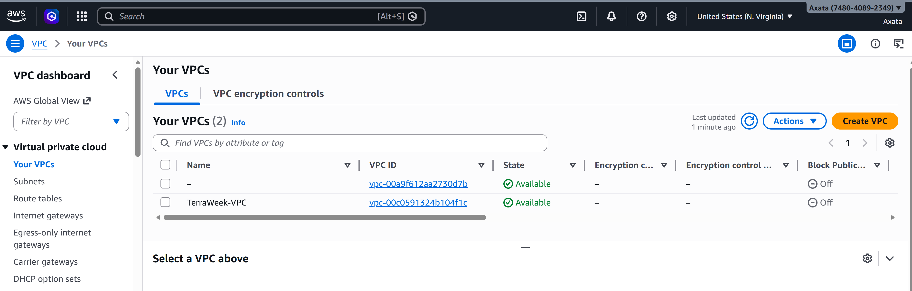
        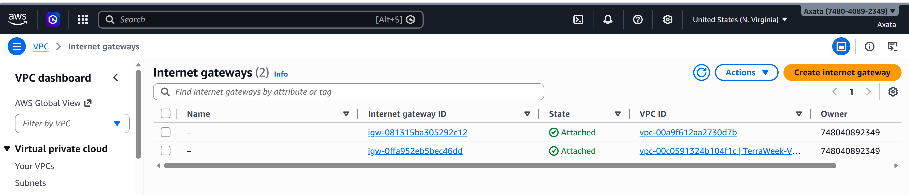
        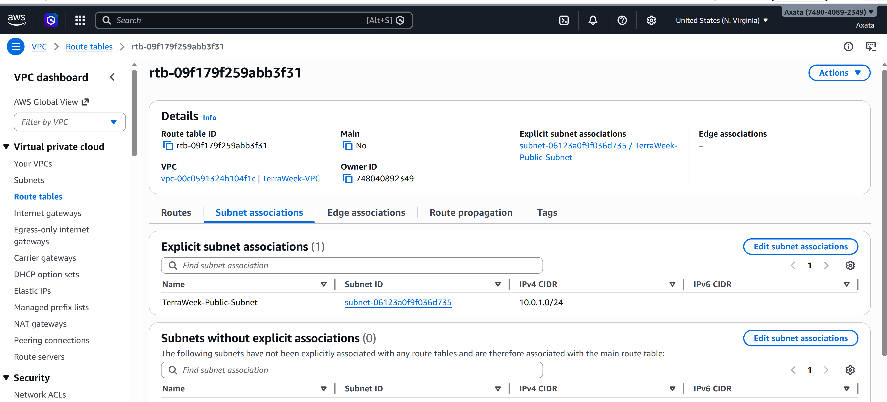
        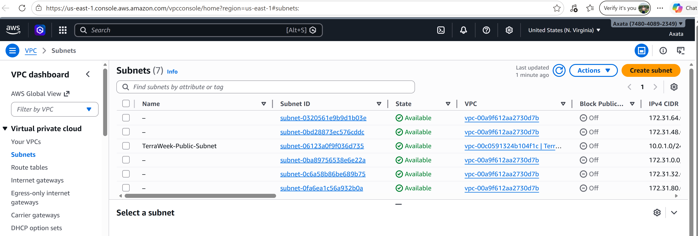

## Task 3: Understand Implicit Dependencies
    ## Key Concept

    Terraform builds dependency graph using references

    Examples in  code
        | Resource | Depends On           |
        | -------- | -------------------- |
        | Subnet   | VPC                  |
        | IGW      | VPC                  |
        | Route    | IGW + Route Table    |
        | RTA      | Subnet + Route Table |

        How Terraform knows order?

            It sees references like:
            vpc_id = aws_vpc.main.id

        If subnet created before VPC?
            It would fail (VPC ID doesn’t exist)

        Implicit dependencies list
            aws_subnet → aws_vpc
            aws_igw → aws_vpc
            aws_route → aws_igw
            aws_rta → subnet + route_table

## Task 4: Add Security Group & EC2
    ## Step 1: Security Group
        resource "aws_security_group" "sg" {
        vpc_id = aws_vpc.main.id

        ingress {
            from_port   = 22
            to_port     = 22
            protocol    = "tcp"
            cidr_blocks = ["0.0.0.0/0"]
        }

        ingress {
            from_port   = 80
            to_port     = 80
            protocol    = "tcp"
            cidr_blocks = ["0.0.0.0/0"]
        }

        egress {
            from_port   = 0
            to_port     = 0
            protocol    = "-1"
            cidr_blocks = ["0.0.0.0/0"]
        }

        tags = {
            Name = "TerraWeek-SG"
        }
        }

    ## Step 2: EC2 Instance

        resource "aws_instance" "main" {
        ami                         = "ami-0c02fb55956c7d316" # update per region
        instance_type               = "t3.micro"
        subnet_id                   = aws_subnet.public.id
        vpc_security_group_ids      = [aws_security_group.sg.id]
        associate_public_ip_address = true

        tags = {
            Name = "TerraWeek-Server"
        }
        }

    ## Step 3: Apply
        terraform apply
        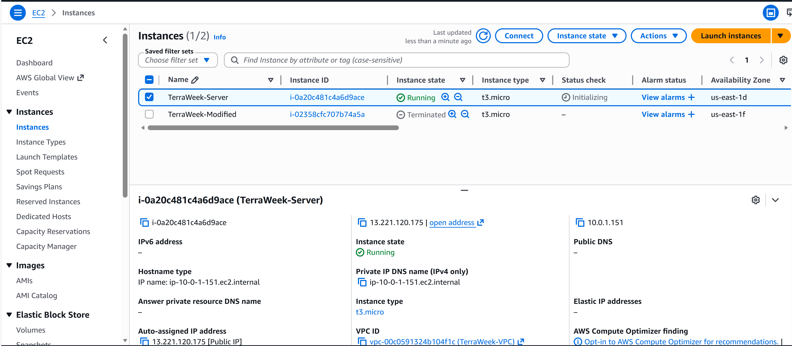
        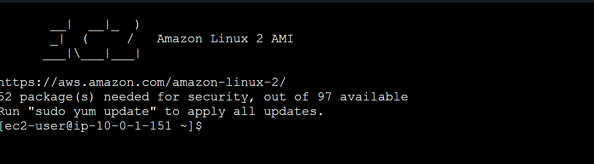

## Task 5: Explicit Dependencies
    ## Step 1: Add S3 Bucket
        resource "aws_s3_bucket" "logs" {
        bucket = "terrawk-logs-unique-name"

        depends_on = [aws_instance.main]
        }
        
        Why depends_on?
            No direct reference exists
            Terraform wouldn’t know order otherwise

    ## Step 2: Plan
        terraform plan
        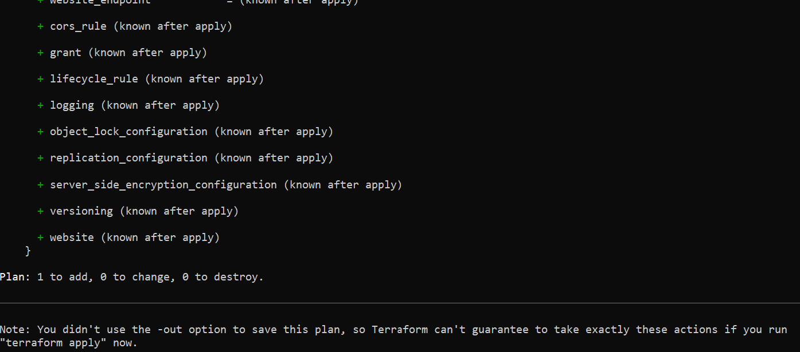
        terraform apply
        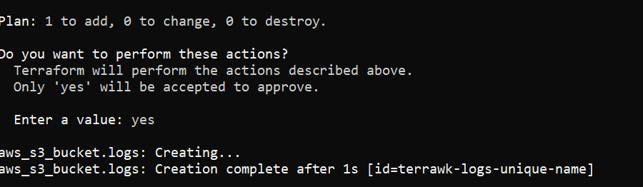

    ## Step 3: Generate Graph
        terraform graph
        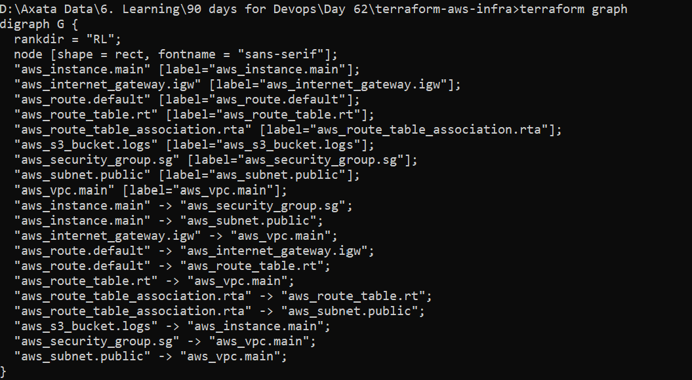

    ## When to Use depends_on?
        App must run after infrastructure ready
        Logging/monitoring after service creation

## Task 6: Lifecycle Rules
    ## Step 1: Add Lifecycle to EC2
        resource "aws_instance" "main" {
        ...

        lifecycle {
            create_before_destroy = true
        }
        }
    
    ## Step 2: Change AMI
        ami = "new-ami-id"
    
    ## Step 3: Plan
        terraform plan
        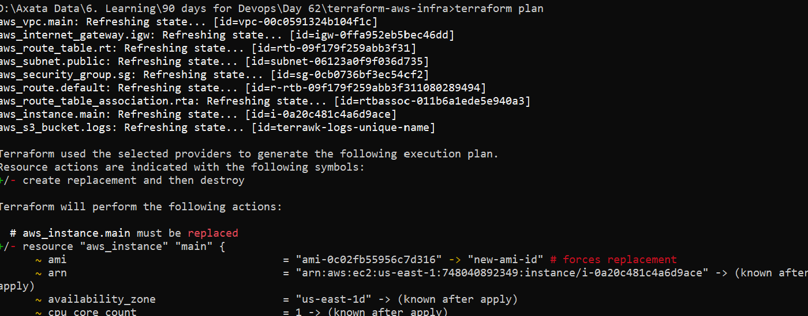
        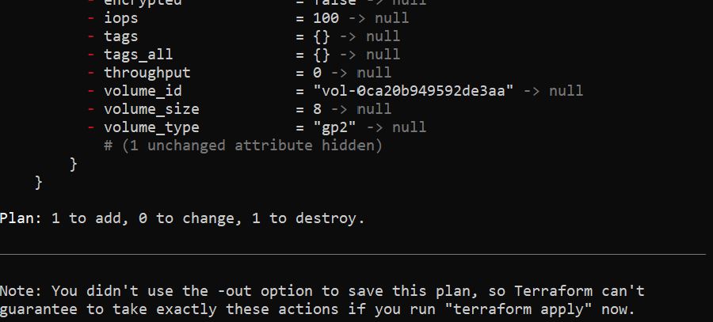
    
    ## Step 4: Destroy Everything
        terraform destroy
        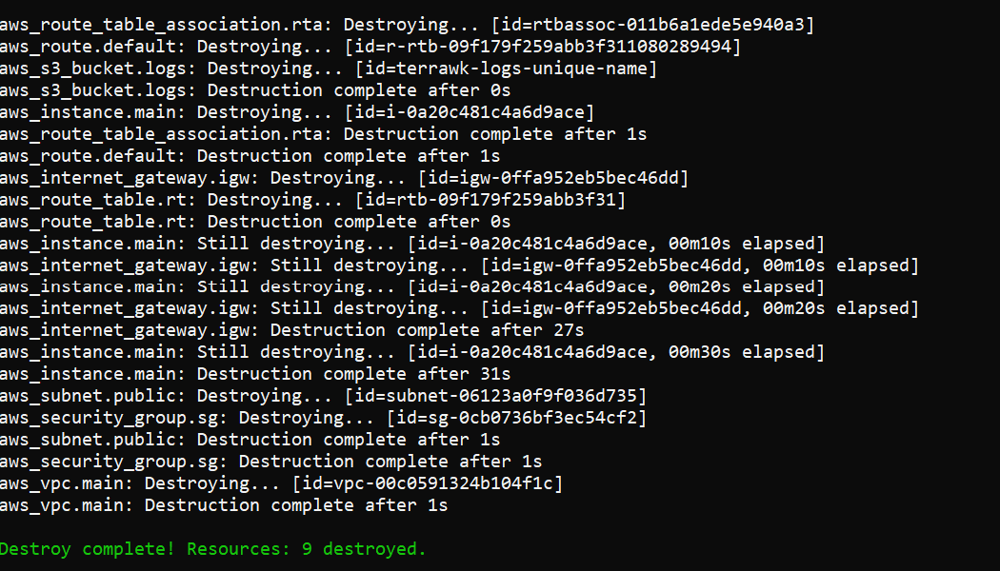
    
    ## Lifecycle Arguments Explained
        | Argument                | Use Case                               |
        | ----------------------- | -------------------------------------- |
        | `create_before_destroy` | Zero downtime deployments              |
        | `prevent_destroy`       | Protect critical resources             |
        | `ignore_changes`        | Ignore drift (e.g., tags, autoscaling) |
