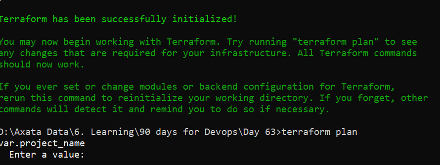
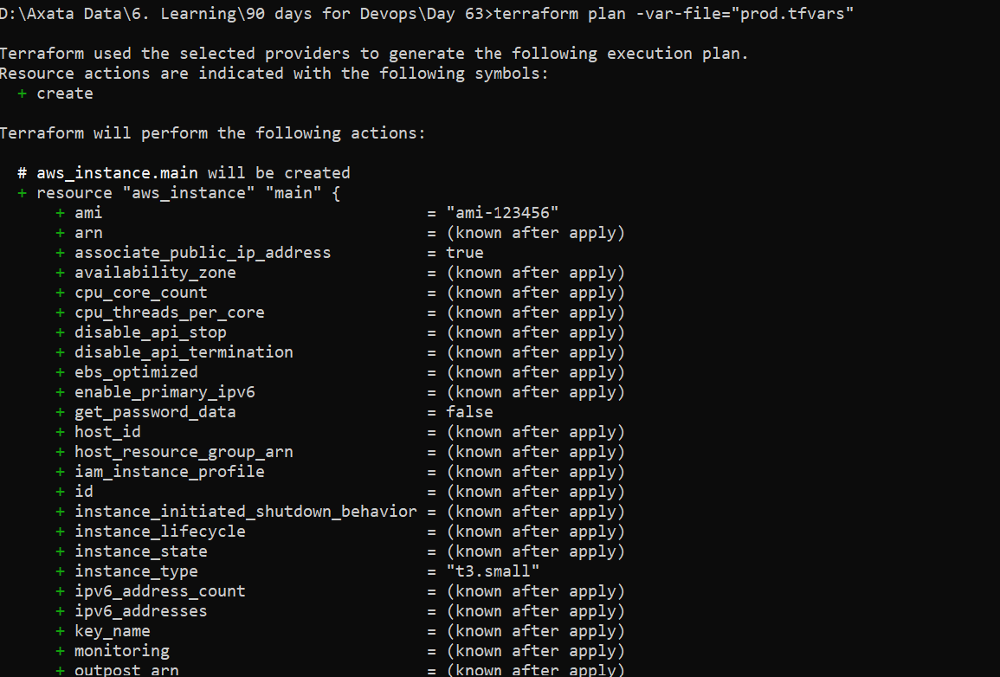
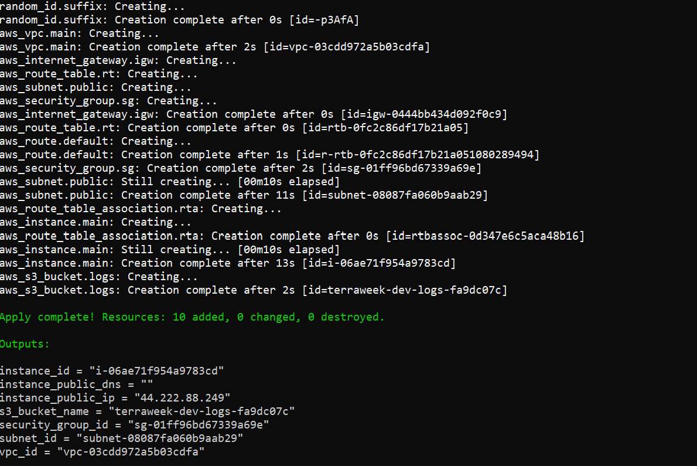
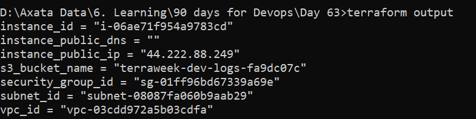
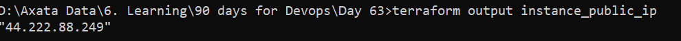
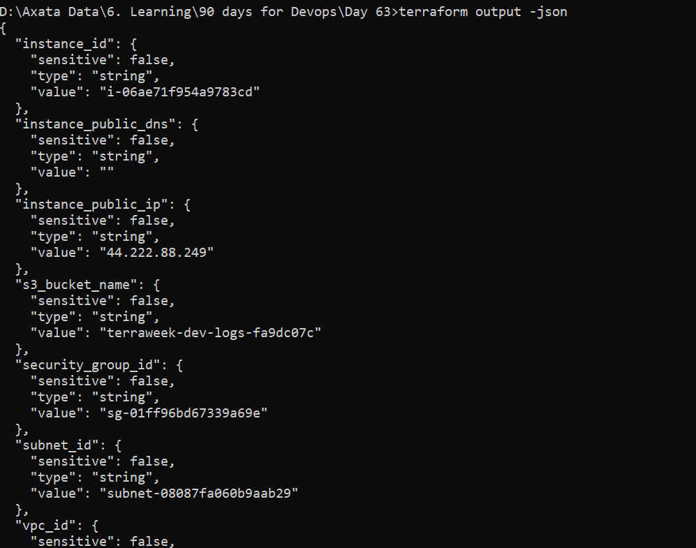
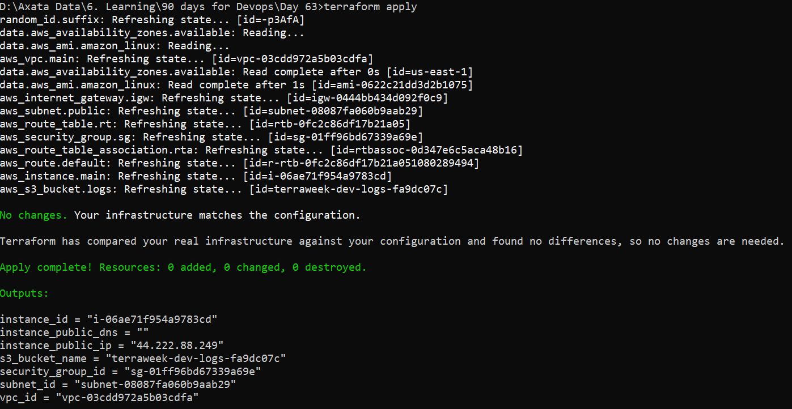
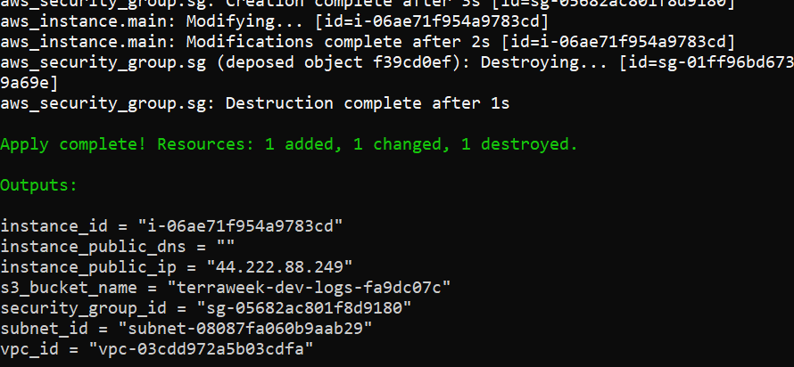
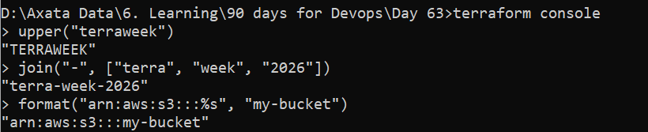
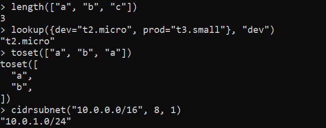

🚀 Day 63 — Variables, Outputs, Data Sources & Expressions (Step-by-Step)

## Task 1: Extract Variables
    Step 1: Create variables.tf

        Create file:
            touch variables.tf

        Add:

            variable "region" {
            type    = string
            default = "us-east-1"
            }

            variable "vpc_cidr" {
            type    = string
            default = "10.0.0.0/16"
            }

            variable "subnet_cidr" {
            type    = string
            default = "10.0.1.0/24"
            }

            variable "instance_type" {
            type    = string
            default = "t3.micro"
            }

            variable "project_name" {
            type = string
            }

            variable "environment" {
            type    = string
            default = "dev"
            }

            variable "allowed_ports" {
            type    = list(number)
            default = [22, 80, 443]
            }

            variable "extra_tags" {
            type    = map(string)
            default = {}
            }
            
    Step 2: Replace hardcoded values in main.tf
        Replace all values like:
            Before:
            cidr_block = "10.0.0.0/16"
            After:
            cidr_block = var.vpc_cidr

        Do this for:
            region → var.region
            CIDRs → var.vpc_cidr, var.subnet_cidr
            instance type → var.instance_type
            tags → later via locals
            ports → var.allowed_ports

    Step 3: Run plan
        terraform plan

        Terraform variable types:

        string → text
        number → numeric values
        bool → true/false
        list → ordered array
        map → key-value pairs

        

## TASK 2: Variable Files & Precedence
    Step 1: Create terraform.tfvars
    Add:

        project_name  = "terraweek"
        environment   = "dev"
        instance_type = "t3.micro"
    
    Step 2: Create prod.tfvars
    Add:

        project_name  = "terraweek"
        environment   = "prod"
        instance_type = "t3.small"
        vpc_cidr    = "10.1.0.0/16"
        subnet_cidr = "10.1.1.0/24"

    Step 3: Apply default tfvars
        terraform plan

    Step 4: Apply prod file
        terraform plan -var-file="prod.tfvars"
        

    Step 5: CLI override
        terraform plan -var="instance_type=t3.nano"

    Step 6: Environment variable
        Linux/Mac/Git Bash:
        export TF_VAR_environment="staging"
        terraform plan
    
    Variable Precedence (LOW → HIGH)
        Default values in variables.tf
            terraform.tfvars
            *.auto.tfvars
            -var-file
            -var CLI
            TF_VAR_* environment variables

## TASK 3: Outputs
    Step 1: Create outputs.tf
        🧾 Add outputs:
        output "vpc_id" {
        value = aws_vpc.main.id
        }

        output "subnet_id" {
        value = aws_subnet.public.id
        }

        output "instance_id" {
        value = aws_instance.web.id
        }

        output "instance_public_ip" {
        value = aws_instance.web.public_ip
        }

        output "instance_public_dns" {
        value = aws_instance.web.public_dns
        }

        output "security_group_id" {
        value = aws_security_group.web_sg.id
        }
    
    Step 2: Apply
        terraform apply
        

    Step 3: Verify outputs
        terraform output
        

        terraform output instance_public_ip
        

        terraform output -json
        

## TASK 4: Data Sources (Remove hardcoded AMI)
    Step 1: Add AMI data source

        In main.tf:
            data "aws_ami" "amazon_linux" {
            most_recent = true
            owners      = ["amazon"]

            filter {
                name   = "name"
                values = ["amzn2-ami-hvm-*"]
            }

            filter {
                name   = "virtualization-type"
                values = ["hvm"]
            }
            }
    
    Step 2: Replace AMI in EC2
        Before:
            ami = "ami-123456"
        After:
            ami = data.aws_ami.amazon_linux.id
    
    Step 3: Add AZ data source
        data "aws_availability_zones" "available" {}
    
    Step 4: Use first AZ
        availability_zone = data.aws_availability_zones.available.names[0]
    
    Step 5: Apply
        terraform apply
        

    Resource vs Data Source
        | Type        | Meaning                       |
        | ----------- | ----------------------------- |
        | Resource    | Creates infrastructure        |
        | Data Source | Reads existing infrastructure |

## TASK 5: Locals (Clean naming + tags)
    Step 1: Add locals block
    In main.tf:

        locals {
        name_prefix = "${var.project_name}-${var.environment}"

        common_tags = {
            Project     = var.project_name
            Environment = var.environment
            ManagedBy   = "Terraform"
        }
        }
    
    Step 2: Update naming
        VPC:
        tags = merge(local.common_tags, {
        Name = "${local.name_prefix}-vpc"
        })
        Subnet:
        tags = merge(local.common_tags, {
        Name = "${local.name_prefix}-subnet"
        })
        Instance:
        tags = merge(local.common_tags, {
        Name = "${local.name_prefix}-server"
        })
    
    Step 3: Apply
        terraform apply
        

## TASK 6: Terraform Console + Functions
    Step 1: Open console
        terraform console
        Try these:
            String functions:
                upper("terraweek")
                join("-", ["terra", "week", "2026"])
                format("arn:aws:s3:::%s", "my-bucket")
                
            Collection:
                length(["a", "b", "c"])
                lookup({dev="t2.micro", prod="t3.small"}, "dev")
                toset(["a", "b", "a"])
            Networking:
                cidrsubnet("10.0.0.0/16", 8, 1)
            
            Add conditional expression in EC2:
                instance_type = var.environment == "prod" ? "t3.small" : "t2.micro"
            Apply:
                terraform apply
    Try:
    terraform apply -var="environment=prod"

## Document 5 useful functions:

Example:

join() → combines strings
lookup() → fetch value from map
cidrsubnet() → creates subnet ranges
merge() → combines tags/maps
upper() → converts string to uppercase