###  Day 64 – Terraform State Management and Remote Backends

## Task 1: Inspect Your Current State
    Step 1: Apply your existing config
        terraform init
        terraform apply
    Step 2: Explore Terraform state
        terraform show
        terraform state list
        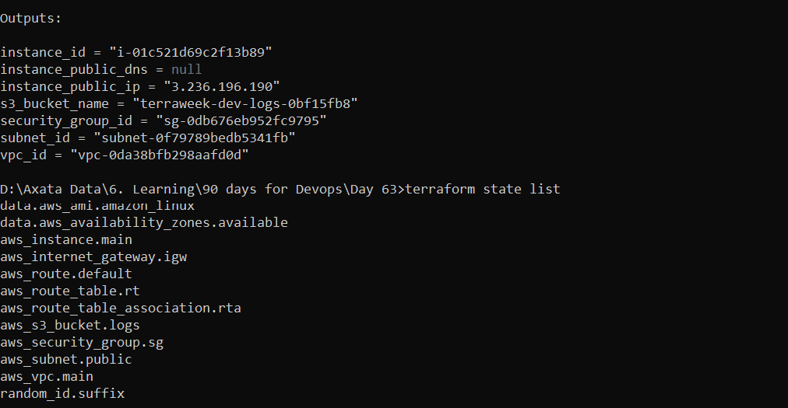
    Step 3: Inspect individual resources
        terraform state show aws_instance.main
        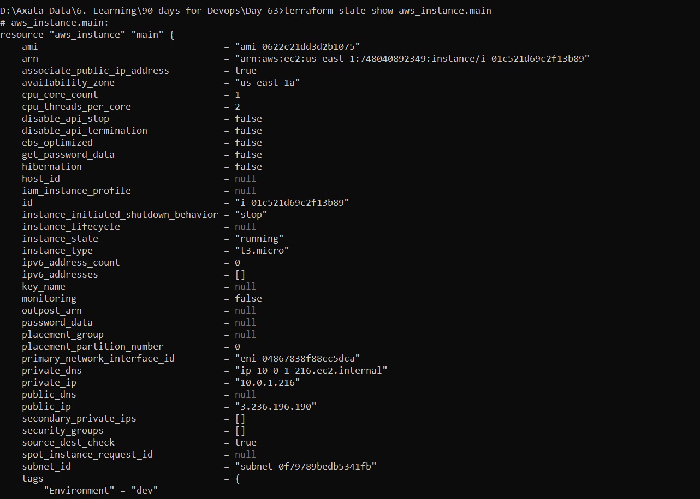
        terraform state show aws_vpc.main
        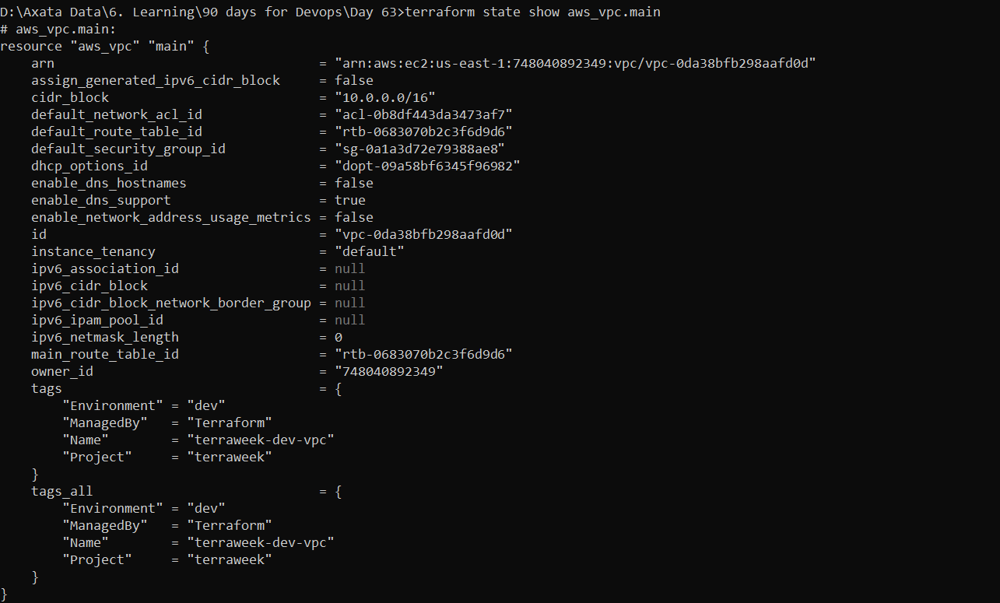
    Step 4: Open state file
        terraform.tfstate
    How many resources?
        → Count from terraform state list
        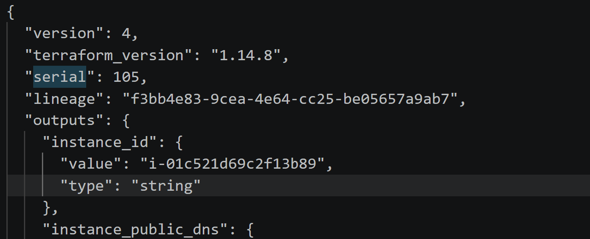
    What attributes?
        → IDs, networking, metadata
    What is serial?
        → Version number of state file (increments every change)

## Task 2: Set Up S3 Remote Backend
    Step 1: Create S3 bucket
        aws s3api create-bucket \
        --bucket terraweek-state-axata \
        --region ap-south-1 \
        --create-bucket-configuration LocationConstraint=ap-south-1
    Step 2: Enable versioning
        aws s3api put-bucket-versioning \
        --bucket terraweek-state-axata \
        --versioning-configuration Status=Enabled
    Step 3: Create DynamoDB table
        aws dynamodb create-table \
        --table-name terraweek-state-lock \
        --attribute-definitions AttributeName=LockID,AttributeType=S \
        --key-schema AttributeName=LockID,KeyType=HASH \
        --billing-mode PAY_PER_REQUEST \
        --region ap-south-1
    Step 4: Add backend config
        terraform {
        backend "s3" {
            bucket         = "terraweek-state-axata"
            key            = "dev/terraform.tfstate"
            region         = "ap-south-1"
            dynamodb_table = "terraweek-state-lock"
            encrypt        = true
        }
        }
    Step 5: Initialize & migrate state
        terraform init
            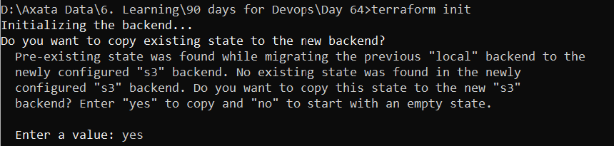
    Step 6: Verify migration
        Check S3 → dev/terraform.tfstate
            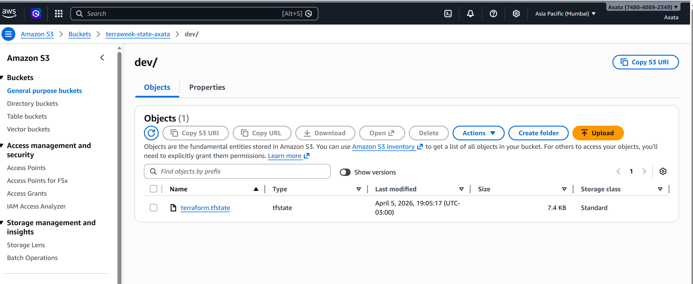
        Run:
            terraform plan
            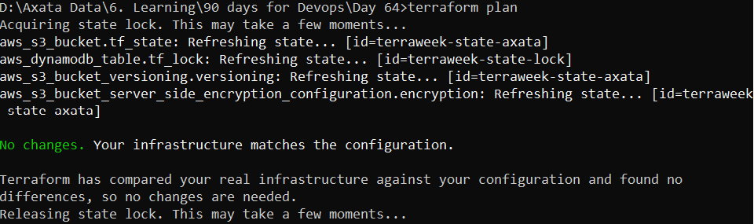

## Task 3: Test State Locking
    Step 1: Open 2 terminals
        Terminal 1:
            terraform apply
        Terminal 2:
            terraform plan
        Expected Error:
            Error acquiring the state lock
            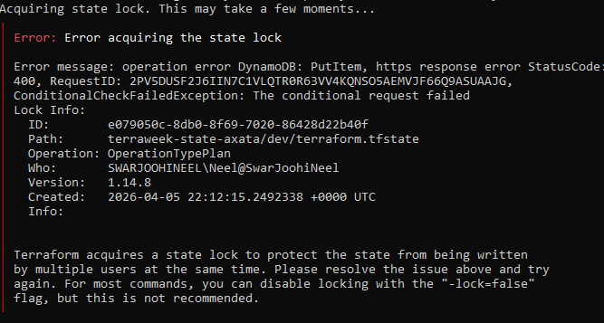

    Why locking is critical
        Prevents:
            Concurrent updates
            State corruption
            Infrastructure mismatch
        If stuck:
            terraform force-unlock <LOCK_ID>

## Task 4: Import Existing Resource
    Step 1: Create bucket manually (AWS Console)
        terraweek-import-test-axata
    Step 2: Add config
        resource "aws_s3_bucket" "imported" {
        bucket = "terraweek-import-test-axata"
        }
    Step 3: Import resource
        terraform import aws_s3_bucket.imported terraweek-import-test-axata
    Step 4: Verify
        terraform plan
        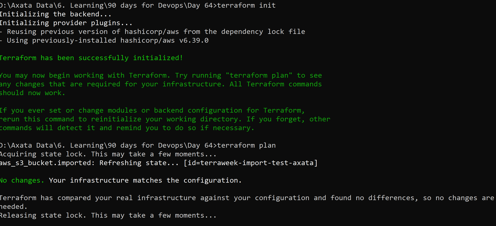
        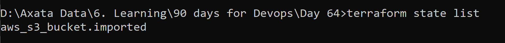
    | Import                               | Create               |
    | ------------------------------------ | -------------------- |
    | Brings existing infra into Terraform | Creates new infra    |
    | No resource creation                 | New resource created |
    | Needs manual config sync             | Fully controlled     |

##  Task 5: State Surgery (mv & rm)
    Step 1: Rename resource
        terraform state mv aws_s3_bucket.imported aws_s3_bucket.logs_bucket
        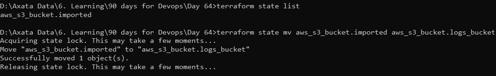

        Update .tf:
            resource "aws_s3_bucket" "logs_bucket" {
            bucket = "terraweek-import-test-axata"
            }

    Step 2: Verify
        terraform plan
        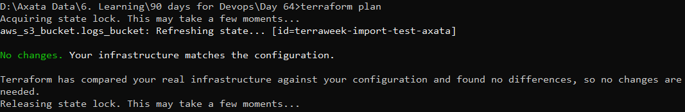

    Step 3: Remove from state
        terraform state rm aws_s3_bucket.logs_bucket
        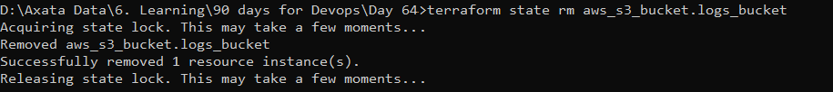

        Result:
            Removed from Terraform
            Still exists in AWS

    Step 4: Re-import
        terraform import aws_s3_bucket.logs_bucket terraweek-import-test-axata
    
    When to use:
        state mv
        → Refactoring / renaming resources
        state rm
        → Stop managing resource without deleting it

## Task 6: Simulate State Drift
    Step 1: Make manual changes in AWS
        Change EC2 tag:
        Name = ManuallyChanged
    
    Step 2: Run plan
        terraform plan
            ~ tags.Name: "ManuallyChanged" → "TerraformManaged"
    
    Step 3: Fix drift
        terraform apply
    
    Step 4: Verify
        terraform plan
        
    🧠 Drift Prevention (IMPORTANT)
    No manual changes in console
    Use CI/CD pipelines
    Restrict IAM permissions
    Code = single source of truth