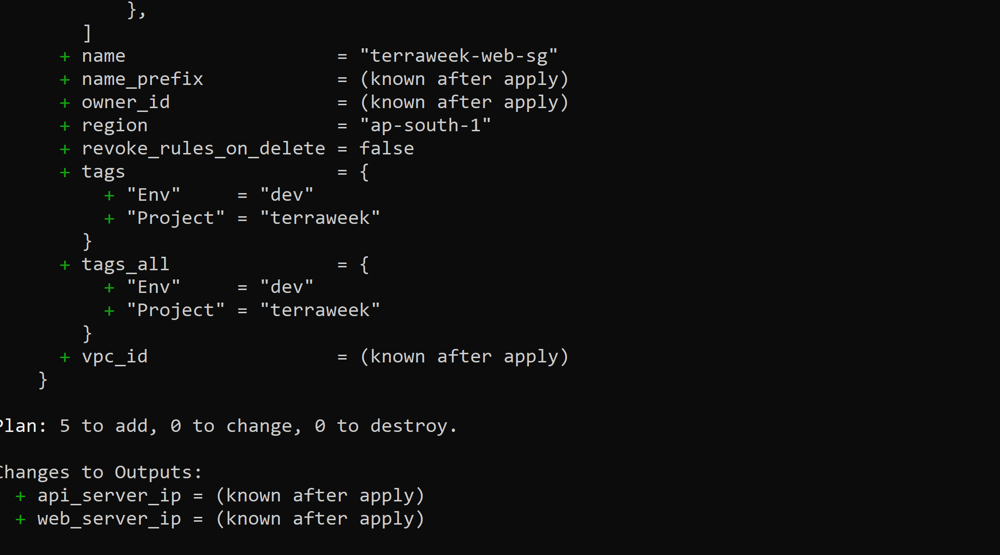
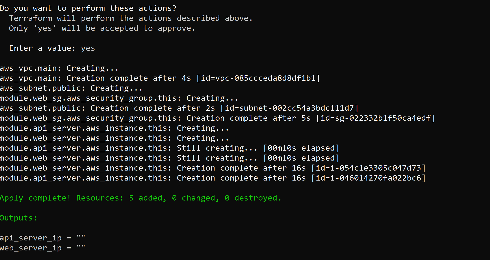

### Day 65 — Terraform Modules (Step-by-Step)

## TASK 1: Understand Module Structure
   Understand Root vs Child Module
    
    Root Module:
        The folder you run terraform apply from
        Contains:
            provider config
            calls modules
            defines overall infrastructure

    Example: terraform-modules/

    Child Module:
        Reusable component inside /modules
        Contains:
            resources (EC2, SG, etc.)
            variables
            outputs

## TASK 2: Build Custom EC2 Module
    Step 1: variables.tf

    modules/ec2-instance/variables.tf

        variable "ami_id" {
        type = string
        }

        variable "instance_type" {
        type    = string
        default = "t3.micro"
        }

        variable "subnet_id" {
        type = string
        }

        variable "security_group_ids" {
        type = list(string)
        }

        variable "instance_name" {
        type = string
        }

        variable "tags" {
        type    = map(string)
        default = {}
        }
    
    Step 2: main.tf

    modules/ec2-instance/main.tf

        resource "aws_instance" "this" {
        ami                    = var.ami_id
        instance_type         = var.instance_type
        subnet_id             = var.subnet_id
        vpc_security_group_ids = var.security_group_ids

        tags = merge(
            var.tags,
            {
            Name = var.instance_name
            }
        )
        }
    
    Step 3: outputs.tf
        output "instance_id" {
        value = aws_instance.this.id
        }

        output "public_ip" {
        value = aws_instance.this.public_ip
        }

        output "private_ip" {
        value = aws_instance.this.private_ip
        }

## TASK 3: Build Security Group Module
    Step 1: variables.tf

    modules/security-group/variables.tf

        variable "vpc_id" {
        type = string
        }

        variable "sg_name" {
        type = string
        }

        variable "ingress_ports" {
        type    = list(number)
        default = [22, 80]
        }

        variable "tags" {
        type    = map(string)
        default = {}
        }

    Step 2: main.tf (Dynamic Block ⭐)
        resource "aws_security_group" "this" {
        name   = var.sg_name
        vpc_id = var.vpc_id

        dynamic "ingress" {
            for_each = var.ingress_ports
            content {
            from_port   = ingress.value
            to_port     = ingress.value
            protocol    = "tcp"
            cidr_blocks = ["0.0.0.0/0"]
            }
        }

        egress {
            from_port   = 0
            to_port     = 0
            protocol    = "-1"
            cidr_blocks = ["0.0.0.0/0"]
        }

        tags = var.tags
        }

    Step 3: outputs.tf
        output "sg_id" {
        value = aws_security_group.this.id
        }

## TASK 4: Call Modules from Root
    Step 1: providers.tf
        provider "aws" {
        region = "ap-south-1"
        }

    Step 2: main.tf (ROOT)
        locals {
        common_tags = {
            Project = "terraweek"
            Env     = "dev"
        }
        }
        # Example VPC (temporary for Task 4)
        resource "aws_vpc" "main" {
        cidr_block = "10.0.0.0/16"
        }

        resource "aws_subnet" "public" {
        vpc_id     = aws_vpc.main.id
        cidr_block = "10.0.1.0/24"
        }

    Step 3: Security Group Module Call
        module "web_sg" {
        source        = "./modules/security-group"
        vpc_id        = aws_vpc.main.id
        sg_name       = "terraweek-web-sg"
        ingress_ports = [22, 80, 443]
        tags          = local.common_tags
        }
        
        EC2 Module — Web Server
        module "web_server" {
        source             = "./modules/ec2-instance"
        ami_id             = data.aws_ami.amazon_linux.id
        instance_type      = "t2.micro"
        subnet_id          = aws_subnet.public.id
        security_group_ids = [module.web_sg.sg_id]
        instance_name      = "terraweek-web"
        tags               = local.common_tags
        }

        EC2 Module — API Server
        module "api_server" {
        source             = "./modules/ec2-instance"
        ami_id             = data.aws_ami.amazon_linux.id
        instance_type      = "t2.micro"
        subnet_id          = aws_subnet.public.id
        security_group_ids = [module.web_sg.sg_id]
        instance_name      = "terraweek-api"
        tags               = local.common_tags
        }
    
    Step 4: Outputs
        output "web_server_ip" {
        value = module.web_server.public_ip
        }

        output "api_server_ip" {
        value = module.api_server.public_ip
        }

    Step 5: Run Terraform
        terraform init
        terraform plan
        

        terraform apply
        

## TASK 5: Use Public Registry Module (VPC)
    Replace your VPC with:
        module "vpc" {
        source  = "terraform-aws-modules/vpc/aws"
        version = "~> 5.0"

        name = "terraweek-vpc"
        cidr = "10.0.0.0/16"

        azs             = ["ap-south-1a", "ap-south-1b"]
        public_subnets  = ["10.0.1.0/24", "10.0.2.0/24"]
        private_subnets = ["10.0.3.0/24", "10.0.4.0/24"]

        enable_nat_gateway = false
        enable_dns_hostnames = true

        tags = local.common_tags
        }
    
    Update module references
        Security Group:
        vpc_id = module.vpc.vpc_id
        EC2 subnet:
        subnet_id = module.vpc.public_subnets[0]
    
    Run:
        terraform init
        terraform plan
        terraform apply
    
    Check downloaded modules:

## TASK 6: Versioning & Best Practices
    Version examples
        version = "5.1.0"
        version = "~> 5.0"
        version = ">= 5.0, < 6.0"
    Upgrade modules
        terraform init -upgrade
    Check state
        terraform state list

    You will see:
        module.vpc
        module.web_server
        module.api_server
        module.web_sg

    Destroy everything
    terraform destroy

## Five module best practices:

Always pin versions for registry modules
Keep modules focused -- one concern per module
Use variables for everything, hardcode nothing
Always define outputs so callers can reference resources
Add a README.md to every custom module

    