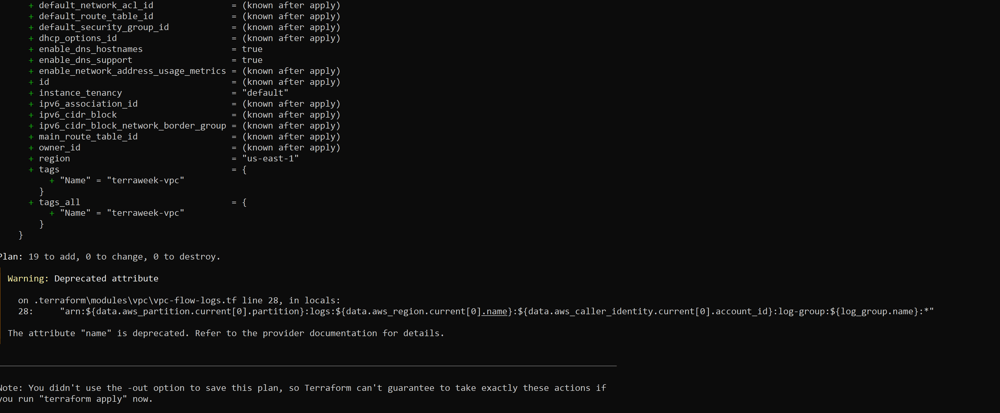

### Day 66 -- Provision an EKS Cluster with Terraform Modules

## Task 1: Project Setup
    Step 1: Create Project Structure
        mkdir terraform-eks
        cd terraform-eks
        touch providers.tf vpc.tf eks.tf variables.tf outputs.tf terraform.tfvars
        mkdir k8s
    
    Step 2: Configure Providers (providers.tf)
        provider "aws" {
        region = var.region
        }

        provider "kubernetes" {
        host                   = module.eks.cluster_endpoint
        cluster_ca_certificate = base64decode(module.eks.cluster_certificate_authority_data)

        exec {
            api_version = "client.authentication.k8s.io/v1beta1"
            command     = "aws"
            args = ["eks", "get-token", "--cluster-name", var.cluster_name]
        }
        }
    
    Step 3: Define Variables (variables.tf)
        variable "region" {
        type = string
        }

        variable "cluster_name" {
        default = "terraweek-eks"
        }

        variable "cluster_version" {
        default = "1.31"
        }

        variable "node_instance_type" {
        default = "t3.medium"
        }

        variable "node_desired_count" {
        default = 2
        }

        variable "vpc_cidr" {
        default = "10.0.0.0/16"
        }
        
    Step 4: Add Values (terraform.tfvars)
        region = "us-east-1"

## Task 2: Create VPC (Registry Module)
    Step 1: Add VPC Module (vpc.tf)
        module "vpc" {
        source  = "terraform-aws-modules/vpc/aws"
        version = "~> 5.0"

        name = "terraweek-vpc"
        cidr = var.vpc_cidr

        azs             = ["us-east-1a", "us-east-1b"]
        public_subnets  = ["10.0.1.0/24", "10.0.2.0/24"]
        private_subnets = ["10.0.3.0/24", "10.0.4.0/24"]

        enable_nat_gateway = true
        single_nat_gateway = true

        enable_dns_hostnames = true

        public_subnet_tags = {
            "kubernetes.io/role/elb" = 1
        }

        private_subnet_tags = {
            "kubernetes.io/role/internal-elb" = 1
        }
        }

    Step 2: Initialize & Validate
        terraform init
        terraform plan
        

    Concept (Important for Interview)
        Why public + private subnets?
            Public → LoadBalancers (internet-facing)
            Private → Worker nodes (secure)

        Subnet Tags Purpose
            AWS uses them to know where to create:
                Public ELB → public subnet
                Internal ELB → private subnet

## Task 3: Create EKS Cluster
    Step 1: Add EKS Module (eks.tf)
        module "eks" {
        source  = "terraform-aws-modules/eks/aws"
        version = "~> 20.0"

        cluster_name    = var.cluster_name
        cluster_version = var.cluster_version

        vpc_id     = module.vpc.vpc_id
        subnet_ids = module.vpc.private_subnets

        cluster_endpoint_public_access = true

        eks_managed_node_groups = {
            terraweek_nodes = {
            ami_type       = "AL2_x86_64"
            instance_types = [var.node_instance_type]

            min_size     = 1
            max_size     = 3
            desired_size = var.node_desired_count
            }
        }

        tags = {
            Environment = "dev"
            Project     = "TerraWeek"
            ManagedBy   = "Terraform"
        }
        }
    
    Step 2: Run Terraform
        terraform init
        terraform plan

    Expect ~30–40 resources:
        EKS cluster
        Node group
        IAM roles
        Security groups
    
## Task 4: Apply & Connect kubectl
    Step 1: Apply Infrastructure
        terraform apply

    Step 2: Add Outputs (outputs.tf)
        output "cluster_name" {
        value = module.eks.cluster_name
        }

        output "cluster_endpoint" {
        value = module.eks.cluster_endpoint
        }

        output "cluster_region" {
        value = var.region
        }

    Step 3: Configure kubectl
        aws eks update-kubeconfig --name terraweek-eks --region us-east-1
    
    Step 4: Verify Cluster
        kubectl get nodes
        kubectl get pods -A
        kubectl cluster-info

        Expected:ye
            2 nodes (Ready)
            kube-system pods running

## Task 5: Deploy Nginx
    
    Step 1: Create YAML (k8s/nginx-deployment.yaml)
        apiVersion: apps/v1
        kind: Deployment
        metadata:
        name: nginx-terraweek
        spec:
        replicas: 3
        selector:
            matchLabels:
            app: nginx
        template:
            metadata:
            labels:
                app: nginx
            spec:
            containers:
            - name: nginx
                image: nginx:latest
                ports:
                - containerPort: 80
        ---
        apiVersion: v1
        kind: Service
        metadata:
        name: nginx-service
        spec:
        type: LoadBalancer
        selector:
            app: nginx
        ports:
        - port: 80
            targetPort: 80
    Step 2: Deploy
        kubectl apply -f k8s/nginx-deployment.yaml
    
    Step 3: Get External IP
        kubectl get svc nginx-service -w
        
    Step 4: Verify
        kubectl get nodes
        kubectl get deployments
        kubectl get pods
        kubectl get svc

        Open browser using LoadBalancer URL → Nginx page

## Task 6: Destroy Everything
    Step 1: Delete Kubernetes Resources
        kubectl delete -f k8s/nginx-deployment.yaml

    Step 2: Destroy Infra
        terraform destroy

    ⏳ Takes 10–15 minutes

    Step 3: Final Verification Checklist

        Go to AWS Console and confirm:

        ✔️ No EKS clusters
        ✔️ No EC2 instances
        ✔️ No VPC
        ✔️ No NAT Gateway
        ✔️ No Elastic IP