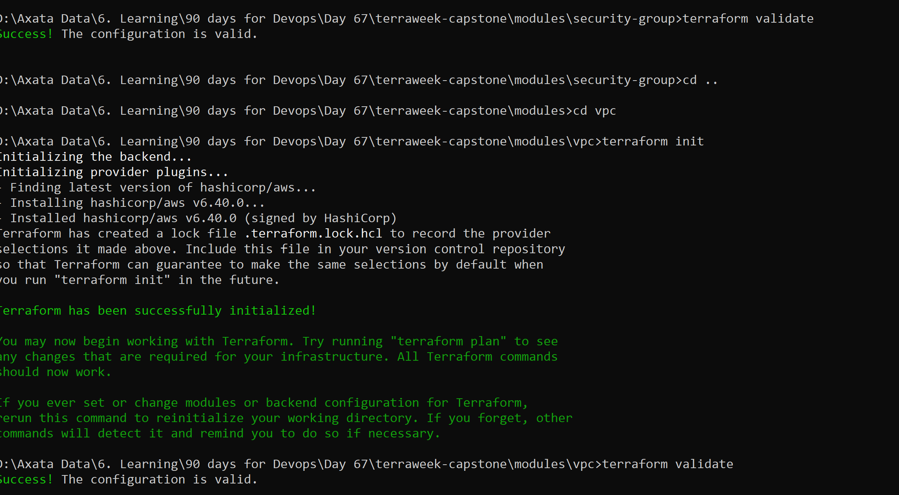

## Day 67 -- TerraWeek Capstone: Multi-Environment Infrastructure with Workspaces and Modules

## Task 1: Learn Terraform Workspaces

    🔹 Step 1: Create project
        mkdir terraweek-capstone
        cd terraweek-capstone
        terraform init

    🔹 Step 2: Workspace commands
        terraform workspace show
        terraform workspace new dev
        terraform workspace new staging
        terraform workspace new prod
        terraform workspace list

    🔹 Step 3: Switch workspaces
        terraform workspace select dev
        terraform workspace select staging
        terraform workspace select prod

        

    ✔ What does terraform.workspace return?
        → Current workspace name (dev, staging, prod)

    ✔ Where is state stored?
        → Locally:
            terraform.tfstate.d/<workspace>/terraform.tfstate

    ✔ Workspaces vs separate directories
        | Workspaces      | Separate Directories   |
        | --------------- | ---------------------- |
        | Single codebase | Multiple copies        |
        | Easier reuse    | Hard to maintain       |
        | Shared config   | Fully isolated configs |

## Task 2: Project Structure
    🔹 Step 1: Create structure
    mkdir modules
    mkdir modules/vpc modules/security-group modules/ec2-instance
    touch main.tf variables.tf outputs.tf providers.tf locals.tf
    touch dev.tfvars staging.tfvars prod.tfvars .gitignore

    🔹 Step 2: Add .gitignore
    .terraform/
    *.tfstate
    *.tfstate.backup
    *.tfvars
    .terraform.lock.hcl
    
    ✔ Why this structure is best practice
    Separation of concerns
    Reusable modules
    Clean environment configs
    Scalable for teams
    Easy debugging

## Task 3 (Corrected): Fully Structured Modules
    Each module MUST have:

    main.tf
    variables.tf
    outputs.tf

    🔷 Module 1: VPC
        📁 modules/vpc/variables.tf
            variable "cidr" {
            description = "VPC CIDR block"
            type        = string
            }

            variable "public_subnet_cidr" {
            description = "Public subnet CIDR"
            type        = string
            }

            variable "environment" {
            type = string
            }

            variable "project_name" {
            type = string
            }

        📁 modules/vpc/main.tf
            resource "aws_vpc" "this" {
            cidr_block = var.cidr

            tags = {
                Name = "${var.project_name}-${var.environment}-vpc"
            }
            }

            resource "aws_subnet" "public" {
            vpc_id     = aws_vpc.this.id
            cidr_block = var.public_subnet_cidr

            tags = {
                Name = "${var.project_name}-${var.environment}-subnet"
            }
            }

            resource "aws_internet_gateway" "igw" {
            vpc_id = aws_vpc.this.id
            }

            resource "aws_route_table" "rt" {
            vpc_id = aws_vpc.this.id
            }

            resource "aws_route" "internet" {
            route_table_id         = aws_route_table.rt.id
            destination_cidr_block = "0.0.0.0/0"
            gateway_id             = aws_internet_gateway.igw.id
            }

            resource "aws_route_table_association" "assoc" {
            subnet_id      = aws_subnet.public.id
            route_table_id = aws_route_table.rt.id
            }

        📁 modules/vpc/outputs.tf
            output "vpc_id" {
            description = "VPC ID"
            value       = aws_vpc.this.id
            }

            output "subnet_id" {
            description = "Public Subnet ID"
            value       = aws_subnet.public.id
            }

    🔷 Module 2: Security Group
        📁 modules/security-group/variables.tf
        variable "vpc_id" {
        type = string
        }

        variable "ingress_ports" {
        type = list(number)
        }

        variable "environment" {
        type = string
        }

        variable "project_name" {
        type = string
        }

        📁 modules/security-group/main.tf
            resource "aws_security_group" "sg" {
            name   = "${var.project_name}-${var.environment}-sg"
            vpc_id = var.vpc_id

            dynamic "ingress" {
                for_each = var.ingress_ports
                content {
                from_port   = ingress.value
                to_port     = ingress.value
                protocol    = "tcp"
                cidr_blocks = ["0.0.0.0/0"]
                }
            }

            egress {
                from_port   = 0
                to_port     = 0
                protocol    = "-1"
                cidr_blocks = ["0.0.0.0/0"]
            }

            tags = {
                Name = "${var.project_name}-${var.environment}-sg"
            }
            }

        📁 modules/security-group/outputs.tf
            output "sg_id" {
            description = "Security Group ID"
            value       = aws_security_group.sg.id
            }

        🔷 Module 3: EC2 Instance
            📁 modules/ec2-instance/variables.tf
            variable "ami_id" {
            type = string
            }

            variable "instance_type" {
            type = string
            }

            variable "subnet_id" {
            type = string
            }

            variable "security_group_ids" {
            type = list(string)
            }

            variable "environment" {
            type = string
            }

            variable "project_name" {
            type = string
            }

            📁 modules/ec2-instance/main.tf
            resource "aws_instance" "ec2" {
            ami                    = var.ami_id
            instance_type          = var.instance_type
            subnet_id              = var.subnet_id
            vpc_security_group_ids = var.security_group_ids

            tags = {
                Name = "${var.project_name}-${var.environment}-server"
            }
            }

            📁 modules/ec2-instance/outputs.tf
            output "instance_id" {
            description = "EC2 Instance ID"
            value       = aws_instance.ec2.id
            }

            output "public_ip" {
            description = "EC2 Public IP"
            value       = aws_instance.ec2.public_ip
            }

        

## Task 4: Wire It All Together with Workspace-Aware Config

    locals.tf:

        locals {
        environment = terraform.workspace
        name_prefix = "${var.project_name}-${local.environment}"

        common_tags = {
            Project     = var.project_name
            Environment = local.environment
            ManagedBy   = "Terraform"
            Workspace   = terraform.workspace
        }
        }

    variables.tf:
        variable "project_name" {
        type    = string
        default = "terraweek"
        }

        variable "vpc_cidr" {
        type = string
        }

        variable "subnet_cidr" {
        type = string
        }

        variable "instance_type" {
        type = string
        }

        variable "ingress_ports" {
        type    = list(number)
        default = [22, 80]
        }

    main.tf -- call all three modules, passing workspace-aware names and variables.
        module "vpc" {
        source = "./modules/vpc"

        cidr               = var.vpc_cidr
        public_subnet_cidr = var.subnet_cidr
        environment        = local.environment
        project_name       = var.project_name
        }

        module "sg" {
        source = "./modules/security-group"

        vpc_id        = module.vpc.vpc_id
        ingress_ports = var.ingress_ports
        environment   = local.environment
        project_name  = var.project_name
        }

        module "ec2" {
        source = "./modules/ec2-instance"

        ami_id            = "ami-0c55b159cbfafe1f0" # update region-wise
        instance_type     = var.instance_type
        subnet_id         = module.vpc.subnet_id
        security_group_ids = [module.sg.sg_id]
        environment       = local.environment
        project_name      = var.project_name
        }

    Environment-specific tfvars:
        dev.tfvars:

        vpc_cidr      = "10.0.0.0/16"
        subnet_cidr   = "10.0.1.0/24"
        instance_type = "t2.micro"
        ingress_ports = [22, 80]
        staging.tfvars:

        vpc_cidr      = "10.1.0.0/16"
        subnet_cidr   = "10.1.1.0/24"
        instance_type = "t2.small"
        ingress_ports = [22, 80, 443]
        prod.tfvars:

        vpc_cidr      = "10.2.0.0/16"
        subnet_cidr   = "10.2.1.0/24"
        instance_type = "t3.small"
        ingress_ports = [80, 443]

## Task 5: Deploy Environments
    🔷 Dev
        terraform workspace select dev
        terraform plan -var-file="dev.tfvars"
        terraform apply -var-file="dev.tfvars"
    🔷 Staging
        terraform workspace select staging
        terraform apply -var-file="staging.tfvars"
    🔷 Prod
        terraform workspace select prod
        terraform apply -var-file="prod.tfvars"

    | Environment | VPC CIDR    | Subnet CIDR |
    | ----------- | ----------- | ----------- |
    | dev         | 10.0.0.0/16 | 10.0.1.0/24 |
    | staging     | 10.1.0.0/16 | 10.1.1.0/24 |
    | prod        | 10.2.0.0/16 | 10.2.1.0/24 |

## Task 6: Best Practices (Use this in your MD file)
    🧠 Terraform Best Practices Cheat Sheet
    📁 Structure
        Split: providers, variables, outputs, locals, main
    🌍 State
        Use S3 backend
        Enable DynamoDB locking
        Versioning ON
    🔧 Variables
        Never hardcode
        Use tfvars
        Add validation
    🧩 Modules
        One responsibility per module
        Always define inputs/outputs
        Version pinning
    🧪 Workspaces
        Use for env isolation
        Use terraform.workspace
    🔐 Security
        Ignore state + tfvars
        Restrict backend access
    ⚙️ Commands
        terraform fmt
        terraform validate
        terraform plan
        terraform apply
    🏷️ Tagging
        Project
        Environment
        ManagedBy
    🧾 Naming
        <project>-<env>-<resource>
    🧹 Cleanup
        Destroy non-prod environments

Task 7: Destroy Everything
    🔥 Destroy in order
        terraform workspace select prod
        terraform destroy -var-file="prod.tfvars"
        terraform workspace select staging
        terraform destroy -var-file="staging.tfvars"
        terraform workspace select dev
        terraform destroy -var-file="dev.tfvars"

    🧼 Delete workspaces
        terraform workspace select default
        terraform workspace delete dev
        terraform workspace delete staging
        terraform workspace delete prod

